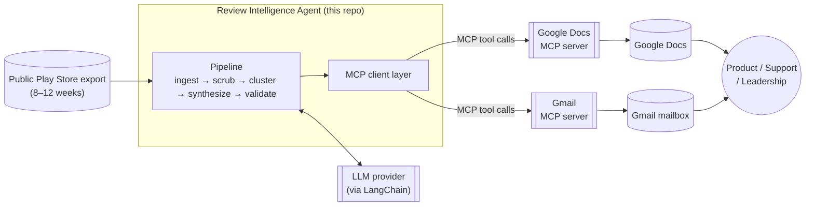
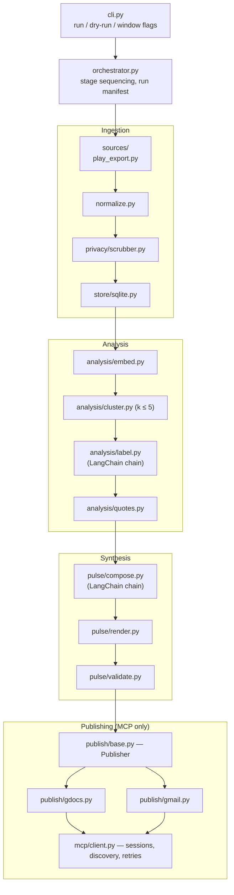
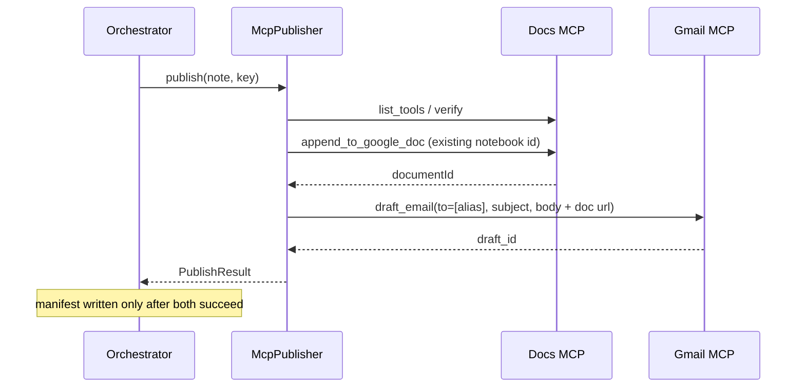

# Architecture — Groww Review Intelligence Agent

> Companion to [`problemStatement.md`](./problemStatement.md). That document defines *what* must be
> built and the constraints; this one defines *how*.
>
> The repository currently contains no code, so every technology choice below is a **proposal**
> recorded as a decision (see [§3 Decision Records](#3-decision-records)) with its alternatives
> stated. Override any of them and the rest of the document still holds — the pipeline shape and
> the validation gates are independent of the stack.

---

## 1. Architectural Drivers

The constraints in the brief are not incidental; each one directly forces a structural choice. This
table is the spine of the whole design.

| # | Driver (from brief) | Architectural consequence |
| --- | --- | --- |
| D1 | Integrations must be **MCP-first** | A dedicated MCP client layer is the *only* code path to Google Docs and Gmail. No `googleapiclient`, no OAuth handling, no REST calls in this repo. |
| D2 | **No PII** in any artifact | PII scrubbing is a mandatory pipeline stage placed at the ingestion boundary, before anything is persisted. Downstream stages can only ever see scrubbed text. |
| D3 | Quotes must be **verbatim**, no invented wording | Quote provenance must be machine-checkable. A validator asserts each quote is an exact substring of a stored review. This is the reason scrubbing must precede quote selection (see [§6.3](#63-why-scrub-before-quoting)). |
| D4 | At most **5 themes**, pulse shows **top 3** | Cluster count is a hard-capped parameter, not an emergent property. The clusterer must accept `k_max = 5` and the renderer selects the 3 largest. |
| D5 | Note is **≤ 250 words**, one scannable page | Word count is a validation gate that can fail a run, not a soft prompt instruction. |
| D6 | **Public exports only**, no ToS-violating scraping | Ingestion is a pluggable source adapter, so the legally-approved acquisition method can change without touching the pipeline. |
| D7 | Reviews span **8–12 weeks** | The run needs an explicit time window parameter and must record the actual window covered by the data it used. |

Two cross-cutting properties I am designing for, not stated in the brief but implied by "weekly":

- **Idempotency** — re-running for the same week updates the same Google Doc and the same Gmail
  draft rather than creating duplicates.
- **Auditability** — every run writes a manifest recording inputs, window, theme assignments, and
  the IDs of the artifacts it produced, so any claim in a pulse can be traced back to source rows.

---

## 2. System Context



The important boundary: **OAuth and Google's REST surface live entirely inside the MCP servers.**
This repo holds no client secrets and no token refresh logic. That is driver D1 realized as a
topology, and it is also why the credentials story below is so short.

---

## 3. Decision Records

Compact ADRs. Each is a real fork in the road, not a formality.

### ADR-1 — Python 3.11+ as the runtime

**Decision.** Python, with `uv` or `pip` + `requirements.txt` for dependencies. Core AI stack:
`langchain-core`, the provider packages (`langchain-groq`, `langchain-google-genai`), and
optionally `langchain-mcp-adapters`.

**Why.** The official MCP Python SDK (`mcp`) is first-class, the clustering/embedding
ecosystem (`scikit-learn`, `numpy`) is the shortest path to a defensible ≤5-theme clusterer, and
LangChain (ADR-6) provides structured-output chains and composable retries for the LLM stages.

**Alternatives.** TypeScript with `@modelcontextprotocol/sdk` — equally viable MCP support, weaker
out-of-the-box clustering. A pure notebook — fastest to demo, but the validation gates in D3/D5
want real unit tests.

### ADR-2 — A standalone MCP *client* application, not an in-IDE agent

**Decision.** The app talks to the Docs and Gmail MCP servers itself, using the MCP SDK's
client API — **stdio** for local/fake servers (Phase 4) and **Streamable HTTP** for the
hosted Railway server (Phase 5).

**Why.** The alternative — driving the whole thing conversationally from an MCP-enabled IDE host —
satisfies the letter of D1 but produces nothing reproducible: no rerun, no tests, no manifest. A
standalone client keeps the run scriptable and reviewable while still being MCP-first.

**Consequence.** MCP endpoint, bearer token, tool names, and the existing Google Doc ID are
configuration ([§9](#9-configuration--secrets)). The app handles session lifecycle, tool
discovery, and errors. Google OAuth stays in the MCP server.

**Fallback.** If the environment only exposes Docs/Gmail MCP through an IDE host, the pipeline stays
identical and the two publish steps are executed by the host agent using the same rendered payload.
This is why publishing sits behind an interface ([§8.1](#81-the-publisher-interface)).

### ADR-3 — Local, file-based persistence (SQLite + JSONL artifacts)

**Decision.** SQLite for normalized reviews; per-run JSONL/JSON artifacts on disk under `runs/`.

**Why.** Single-user weekly batch job. A database server would be pure overhead. SQLite still gives
deduplication via a primary key and cheap window queries.

**Alternatives.** Postgres (unjustified operationally), plain CSV (no dedupe key, no typing).

### ADR-4 — Embedding-based clustering with an LLM only for *labeling*

**Decision.** Cluster numerically (sentence embeddings → agglomerative clustering, `k ≤ 5`), then
ask the LLM to name each resulting cluster from a sample of its members.

**Why.** Asking an LLM to both partition hundreds of reviews and name the partitions is
non-deterministic and hard to cap at 5. Numeric clustering makes D4 a parameter and makes cluster
sizes real counts — which the pulse needs in order to claim a theme is "top."

**Alternatives.** Pure LLM clustering (simpler, unstable, weak counts); fixed keyword taxonomy
(deterministic and cheap, but blind to unanticipated themes). A keyword taxonomy is retained as a
**fallback path** when embeddings are unavailable.

### ADR-5 — Validation gates fail the run rather than being repaired silently

**Decision.** Verbatim-quote, word-count, theme-count, and PII checks run against the assembled
note. Failure raises and aborts before publishing, with one bounded regeneration retry for the
LLM-authored parts.

**Why.** Publishing a pulse that contains a paraphrased "quote" or leaked PII is worse than
publishing nothing. Silent auto-repair would hide exactly the defects D2 and D3 exist to prevent.

### ADR-6 — LangChain for AI orchestration

**Decision.** Use **LangChain** (`langchain-core`, provider-specific chat model package, and
`langchain-mcp-adapters` where helpful) to orchestrate all LLM-facing steps: theme labeling, action
idea generation, and pulse prose framing. Keep numeric clustering in `scikit-learn` / embeddings —
LangChain does not replace that stage.

**Why LangChain fits this agent.**

| Concern | LangChain capability | Where it applies |
| --- | --- | --- |
| Structured LLM outputs | `with_structured_output()` / Pydantic parsers | `Theme` labels, `ActionIdea` objects |
| Composable pipeline steps | LCEL (`RunnableSequence`, `RunnableParallel`) | Label → compose → validate-retry loop |
| Retries on validation failure | `Runnable.with_retry()` + custom fallbacks | Regenerate prose/actions when word-count or grounding gates fail |
| Prompt templates | `ChatPromptTemplate` | Versioned prompts for labeling and pulse framing |
| MCP tool access | `langchain-mcp-adapters` (`MultiServerMCPClient`) | Optional bridge to Docs/Gmail MCP servers from the same orchestration layer |
| Tracing (optional) | LangSmith | Debug prompt inputs/outputs during development |

**What LangChain does *not* own.**

- **Review ingestion** — plain Python adapters reading public Play Store exports.
- **PII scrubbing** — deterministic regex/rules module (no LLM).
- **Clustering** — embeddings + `scikit-learn` (ADR-4); cluster counts must be real, not LLM-invented.
- **Quote selection** — extractive, non-LLM (D3).
- **Validation gates** — custom Python assertions; LangChain may *retry* after a gate failure but does not replace the gate.
- **MCP publishing (minimum path)** — the native MCP Python SDK remains valid; LangChain is an optional orchestration wrapper around the same tool calls via `langchain-mcp-adapters`.

**Suggested LangChain layout.**

```
src/reviewpulse/
├─ chains/
│  ├─ label_themes.py      # cluster sample → Theme label + summary (structured output)
│  ├─ compose_pulse.py     # themes + quotes → prose frame + ActionIdea list (structured output)
│  └─ retry_policy.py      # bounded retry when validate gates fail
├─ prompts/
│  ├─ label_themes.yaml
│  └─ compose_pulse.yaml
└─ llm/
   ├─ factory.py            # ChatGroq / ChatGoogleGenerativeAI, per settings block
   └─ rate_limit.py         # paces calls against each provider's free-tier quotas
```

**Alternatives.** Raw provider SDK calls (fewer dependencies, more boilerplate); LangGraph (add
when the agent needs branching tool-use loops — overkill for the current linear weekly batch).

### ADR-7 — Google Play Store only (v1)

**Decision.** Ship a single ingestion adapter: `sources/play_export.py`. App Store is **out of
scope** for v1 per `problemStatement.md`.

**Why.** Groww's named target is the Play listing (`com.nextbillion.groww`). One adapter keeps
Phase 1 focused; the `ReviewSource` protocol still allows a future `appstore_export.py` without
pipeline changes.

**Consequence.** `RawReview.source` is `"play"` in v1. Downstream clustering, synthesis, and
publishing are store-agnostic.

### ADR-8 — Groq's free tier (`openai/gpt-oss-120b`) as the labeling provider

**Decision.** Run theme labeling on Groq via `langchain-groq`, model `openai/gpt-oss-120b`, and
treat the free tier's published quotas as part of the client contract: `llm/rate_limit.py` paces
calls and `config/settings.toml` `[llm]` holds the numbers. Composition uses a different provider
(ADR-9).

**Why.** OpenAI has no free tier, and nothing in this pipeline needs a frontier model — the LLM
names a theme from six sample reviews and frames prose, while the counts, clusters, and quotes are
all deterministic (ADR-4, D3). `gpt-oss-120b` is one of the few free-tier models with Groq's
constrained-decoding structured output, which is what ADR-6's `with_structured_output()` relies on.

**Consequence.** Tokens, not requests, are the scarce resource: 8K per minute against a ~1.3K
labeling call, versus a 30-request allowance barely touched. The pacer therefore works in token
terms, and the label stage is shaped to send as few as possible — **one call names every theme**
(rules and schema sent once, not per theme), only rejected themes are re-asked, six short samples
per theme instead of ten long ones, and no cluster aggregates. Measured on the 855-review corpus:
5 calls / ~4,300 tokens before, 1 call / ~1,300 after. Naming the themes together also lets the
prompt demand labels that tell them apart, which per-theme calls cannot. A quota breach is a `429`
with `Retry-After`, retried by the SDK; a call that still fails degrades the affected themes to
keyword labels instead of failing the run (EC-CFG-01).

**Alternatives.** OpenAI or Anthropic — better models, no free tier. A local Ollama model — free and
private, but structured output and 120B-class labeling quality both get worse, and the run stops
being reproducible across machines. Only `llm/factory.py` would change either way.

### ADR-9 — Gemini (`gemini-3.6-flash`) as the composition provider

**Decision.** Phase 3 composition runs on Gemini via `langchain-google-genai`, configured in
`[pulse.llm]` and keyed by `GEMINI_API_KEY`. The provider becomes a property of a settings block
rather than a global: `[llm]` configures labeling, `[pulse.llm]` configures composition, and
`llm/factory.py` dispatches on `provider`.

**Why.** The two stages ask for different things. Labeling wants eight-word noun phrases that tell
five clusters apart, and is shaped entirely around Groq's 8K-tokens-per-minute ceiling (ADR-8).
Composition writes a page of prose to a hard word budget, once per run — a workload that fits
Gemini's much larger token allowance and gains nothing from Groq's throughput. Splitting them also
removes a single point of failure: a quota breach, an outage or a deprecated model on one provider
now degrades one stage to its deterministic path instead of the whole run.

**Consequence.** Keys are checked per stage, so `unavailable_reason()` names the variable the user
actually has to set, and a run can be live on one provider while offline on the other. Requests,
not tokens, are the binding limit on this side — at most two calls a run against a 10-per-minute
allowance — so the pacer never engages in practice and exists only to keep the contract honest if
`[pulse.llm]` is repointed at something chattier. `structured_output()` gained a fallback ladder,
trying the strictest binding a client supports before falling back to function calling; both
current clients take `json_schema` with `strict`, so composition keeps the same constrained-decoding
guarantee labeling has, and the ladder only matters if a client supports less. `compose_provider`
and `compose_model` are recorded in the manifest beside `compose_source`.

**Alternatives.** Keeping both stages on Groq — one key, one quota to reason about, but the note's
prose competes with labeling for the same 8K-token minute and both stages die together. Making the
provider a single global with a per-stage model override — simpler config, but it cannot express
two providers at once, which is the whole point.

---

## 4. Container / Module View



Suggested layout:

```
grow-review-aiagent-mcp/
├─ docs/
│  ├─ problemStatement.md
│  └─ architecture.md
├─ pyproject.toml
├─ config/
│  ├─ settings.example.toml      # window, k_max, recipient alias, MCP server commands
│  └─ taxonomy.example.toml      # fallback keyword themes
├─ data/
│  ├─ raw/                       # untouched public exports (git-ignored)
│  └─ reviews.db                 # SQLite, scrubbed only (git-ignored)
├─ runs/<run_id>/                # manifest.json, clusters.json, note.md, publish.json
├─ src/reviewpulse/
│  ├─ cli.py  orchestrator.py  models.py
│  ├─ chains/  prompts/  llm/   # LangChain orchestration
│  ├─ sources/  privacy/  store/  analysis/  pulse/  publish/  mcp/
└─ tests/
   ├─ unit/                      # scrubber, validators, cluster cap
   ├─ contract/                  # fake MCP server
   └─ fixtures/                  # synthetic reviews incl. PII-laden cases
```

---

## 5. Data Model

```python
# models.py — shapes, not final code

class RawReview:            # exactly as the Play export provides it
    source: Literal["play"]   # v1: Play Store only; extend when App Store adapter ships
    external_id: str | None
    rating: int | None
    title: str | None
    text: str
    date: datetime
    author: str | None      # dropped by the scrubber, never persisted

class Review:               # post-scrub, the only form that is stored
    review_id: str          # sha256(source | external_id or normalized text | date)
    source: str
    rating: int | None
    title_clean: str | None
    text_clean: str         # PII-redacted; the substring authority for quotes
    date: datetime
    lang: str | None
    scrub_flags: list[str]  # e.g. ["email", "phone"] — what was redacted

class Theme:
    theme_id: str
    label: str              # LLM-generated, e.g. "KYC verification delays"
    summary: str
    review_ids: list[str]
    size: int
    mean_rating: float | None
    rank: int               # 1..5 by size

class Quote:
    review_id: str
    theme_id: str
    text: str               # MUST be an exact substring of Review.text_clean
    rating: int | None

class ActionIdea:
    text: str
    theme_ids: list[str]    # every action must cite ≥1 theme (grounding requirement)

class PulseNote:
    run_id: str
    window_start: date; window_end: date
    review_count: int
    top_themes: list[Theme]     # len == 3
    quotes: list[Quote]         # len == 3
    actions: list[ActionIdea]   # len == 3
    word_count: int             # ≤ 250

class PublishResult:
    doc_id: str | None; doc_url: str | None
    draft_id: str | None
    idempotency_key: str        # f"{app}:{window_end:%G-W%V}"
```

`review_id` is a content hash, which makes re-importing an overlapping export a no-op — necessary
because weekly runs over an 8–12 week window will re-see most rows every time.

---

## 6. Pipeline Stages

### 6.1 Ingest & normalize

A `ReviewSource` protocol with one method, `fetch(window) -> Iterable[RawReview]`. The v1 adapter
(`play_export.py`) reads a **public Play Store export file** (CSV/JSON) placed in `data/raw/`. Per
D6, the adapter never authenticates against a store or scrapes a logged-in surface; acquisition
method is a configuration/ops concern deliberately kept outside the code path.

Normalization: coerce dates to UTC, clamp ratings to 1–5, drop rows with empty text, detect
language, and filter to the requested window. The window is a parameter (default: 12 weeks back
from today), and the **actual** min/max dates present in the accepted rows are recorded in the
manifest — a run must not claim 12 weeks of coverage if the export only held 6.

### 6.2 PII scrubbing (D2)

Runs *before* the store write, so the database physically cannot hold PII.

- **Field-level:** `author` and any handle/profile/device column is dropped, not redacted — it is
  never carried into `Review`.
- **Pattern-level** on `title`/`text`: emails, phone numbers, long digit runs (account/PAN/order
  IDs), URLs with query strings, UUID/device-ID shapes, and `@handles`, each replaced with a stable
  placeholder such as `[email]` or `[number]`.
- Every substitution appends to `scrub_flags`, so the run manifest can report how much redaction
  occurred, and a suspicious spike is visible rather than silent.

Deliberate choice: replace with placeholders rather than delete, so a quote containing a redacted
span still reads as a coherent sentence.

### 6.3 Why scrub before quoting

This ordering is the subtle part of the design and worth stating plainly.

If quotes were selected from raw text and scrubbed afterwards, the published quote would no longer
match its source, and the verbatim check in D3 would have to be relaxed to a fuzzy comparison —
which is precisely the loophole through which paraphrased quotes slip in. By scrubbing first and
treating `text_clean` as the single authority, "verbatim" stays an **exact substring assertion**:
cheap, unambiguous, and impossible to satisfy with invented wording.

The honest trade-off: a quote may contain `[number]` where the reviewer wrote a digit string. That
is the correct outcome under D2, and the placeholder makes the redaction visible to the reader
instead of pretending nothing was removed.

### 6.4 Embedding & clustering (D4)

Embed `title_clean + text_clean` with a sentence-embedding model. Cluster with agglomerative
clustering (cosine, average linkage) constrained to `n_clusters = min(k_max, viable)` where
`k_max = 5`. A tiny-cluster rule folds clusters below a size floor into their nearest neighbour, so
the pulse never reports a "theme" backed by two reviews.

Determinism matters for reviewability: fix random seeds, pin the embedding model, and cache
embeddings keyed by `review_id` + model name so re-runs are both fast and stable.

**Fallback path:** if embeddings are unavailable, classify against the keyword taxonomy in
`config/taxonomy.toml` (onboarding, KYC, payments, statements, withdrawals — the brief's own
examples), capped at the same 5. Coarser, fully deterministic, zero LLM cost.

### 6.5 Theme labeling (LangChain)

A single **LangChain chain** (`label_themes`) call covers every cluster: each block carries the
cluster's anchor terms and a stratified sample of its reviews (spanning ratings, short end of the
quotable band), and the structured answer is one entry per `theme_id` — a short noun-phrase `label`
plus a one-sentence `summary`, constrained to describe only what appears in that block. Use
`ChatPromptTemplate` + `llm.with_structured_output(ThemeLabels)` so the response is parsed into
typed objects, not free-form JSON. Batching is a token decision (ADR-8) and a quality one: the
prompt can only ask for labels that tell the themes apart if the model sees them together.

Cluster size and mean rating come from the data, never from the model — the LLM names the theme, it
does not get to assert how prevalent the theme is.

### 6.6 Quote selection (D3)

Candidates are drawn from the top 3 themes and scored on centrality to the cluster centroid,
length (one or two sentences — long enough to carry meaning, short enough for a one-pager), and
information density. Guardrails: one quote per theme for coverage, no two quotes from the same
review, prefer quotes with no or few `scrub_flags` so redaction placeholders stay rare.

Selection is **extractive by construction** — it slices spans out of `text_clean` — so the LLM is
never in a position to author a quote at all. The validator in [§7](#7-validation-gates) is a
backstop, not the primary defence.

### 6.7 Compose the note (LangChain + renderer)

Inputs: top 3 themes with labels/sizes/mean ratings, the 3 selected quotes, and aggregate stats.
A **LangChain chain** (`compose_pulse`) writes the prose frame and produces 3 `ActionIdea` objects
via structured output. The quotes are **injected verbatim by the renderer, not passed through the
model's output**. Each action idea must cite the `theme_id`s it addresses, which is what makes
"grounded in the themes" enforceable rather than aspirational.

If validation gates fail (word count, action grounding), the orchestrator re-invokes the compose
chain with a tighter prompt budget — at most one bounded retry via `Runnable.with_retry()` or an
explicit loop in `orchestrator.py`.

Rendered structure, kept under 250 words:

```
Groww — Weekly Review Pulse · <window> · <n> reviews · avg <x.x>★

Top themes
1. <label> — <count> reviews (<share>%), avg <x.x>★ · <one line>
2. …
3. …

What users said
- "<verbatim quote>" — <rating>★
- …

Three things to do next
1. <action> (theme: <label>)
2. …
3. …
```

Two render targets from one `PulseNote`: Markdown/plain text for the Gmail body, and a structured
request for Google Docs. Word count is measured on the final rendered note, not on the LLM output.

---

## 7. Validation Gates

Between synthesis and publishing. Any failure aborts the run; nothing partial is published.

| Gate | Assertion | On failure |
| --- | --- | --- |
| `themes_capped` | `len(all_themes) ≤ 5` and `len(top_themes) == 3` | Abort — clusterer misconfigured |
| `quotes_verbatim` | each `quote.text in store.get(quote.review_id).text_clean` | Abort, log the offending quote |
| `quotes_count` | exactly 3, distinct `review_id`s | One bounded reselect, then abort |
| `actions_grounded` | exactly 3, each citing ≥1 real `theme_id` | One bounded regeneration, then abort |
| `word_count` | `≤ 250` on the rendered note | One regeneration with a tighter budget, then abort |
| `no_pii` | scrubber patterns find zero matches in the rendered note | Abort — hard stop, never auto-repaired |
| `window_declared` | manifest window matches the data actually used | Abort |

`no_pii` re-runs the ingestion-time detectors against the *final artifact*. Checking the same rules
at both ends of the pipeline is intentional: it catches leakage introduced by any stage in between,
including the LLM echoing something from a prompt.

---

## 8. MCP Integration Layer (D1)

Docs and Gmail remain **MCP-first** (D1). Two integration paths are supported:

1. **Native MCP Python SDK** (default in `mcp/client.py`) — stdio *or* Streamable HTTP, tool
   discovery, and tool calls. Hosted gmail-docs-mcp is HTTP + bearer; local fakes stay stdio.
2. **LangChain bridge** (`langchain-mcp-adapters`) — load Docs/Gmail MCP servers as LangChain tools
   and invoke them from the orchestrator or a thin publish chain. Same MCP servers, same credentials
   boundary; only the client wrapper differs.

Choose one path per deployment; do not duplicate both for the same server in one run.

### 8.1 The `Publisher` interface

```python
class Publisher(Protocol):
    def publish_doc(self, note: PulseNote, key: str) -> DocRef: ...
    def create_draft(self, note: PulseNote, doc: DocRef, key: str) -> DraftRef: ...
```

Implementations: `McpPublisher` (default), `DryRunPublisher` (writes to `runs/<id>/` and asserts
payload shape — used by tests and by every development iteration), and, if the environment forces
ADR-2's fallback, a host-driven variant consuming the identical payload.

### 8.2 Session lifecycle and tool discovery

MCP server names and commands are configuration, because server implementations differ and tool
names are not standardized across them:

```toml
[mcp]
url = "https://mcp-gmail-google-docs-connect-production.up.railway.app/mcp"
auth_token = "${MCP_AUTH_TOKEN}"

[mcp.gdocs]
document_id = "<existing Google Doc id>"
tools = { append = "append_to_google_doc" }

[mcp.gmail]
tools = { create_draft = "draft_email" }
```

Stdio servers remain valid when `url` is empty and `command` / `args` are set. At startup the
client opens a session, calls `list_tools`, and verifies the configured tool names. **Failing
fast here** — before any LLM spend or publishing — turns a missing bearer token or a renamed
tool into a clear startup error. `send_email` may appear in `list_tools`; this agent never
calls it.

### 8.3 Publish sequence



### 8.4 Reliability

- **Idempotency.** `key = "groww:<ISO year>-W<week>"` is embedded in the notebook heading and
  email subject. The hosted server cannot search or replace, so same-week retries skip append
  using the local publish-state store. Gmail drafts are created fresh when the server has no
  update tool.
- **Retries.** Transport and 5xx-equivalent tool errors retry with exponential backoff and jitter,
  max 3 attempts — except `append_to_google_doc` / `draft_email` / `send_email`, which must not
  be retried after an uncertain error (the write may already have landed). Auth and validation
  errors do not retry.
- **Partial failure.** Docs succeeding then Gmail failing is the realistic case. The notebook id is
  persisted immediately, so a retry does not append a second copy of the note.
- **Gmail is draft-only.** `send_email` is never invoked, matching the brief exactly.

---

## 9. Configuration & Secrets

| Item | Where | Notes |
| --- | --- | --- |
| Window, `k_max`, size floor | `config/settings.toml` | `k_max` fixed at 5 by D4 |
| Recipient alias | `config/settings.toml` | The Gmail draft's `to` |
| Labeling API key | env (`GROQ_API_KEY`) | Wired through `llm/factory.py` → `ChatGroq` |
| Composition API key | env (`GEMINI_API_KEY`) | Wired through `llm/factory.py` → `ChatGoogleGenerativeAI` |
| Labeling model + rate limits | `config/settings.toml` `[llm]` | `openai/gpt-oss-120b`; quotas enforced by `llm/rate_limit.py`. `LLM_MODEL` overrides the model for one run |
| Composition model + rate limits | `config/settings.toml` `[pulse.llm]` | `gemini-3.6-flash`; same pacer. `GEMINI_MODEL` overrides the model for one run |
| LangSmith tracing (optional) | env (`LANGCHAIN_TRACING_V2`, `LANGCHAIN_API_KEY`) | Dev/debug only |
| Google credentials | **nowhere in this repo** | Owned by the MCP servers per D1 |
| MCP server URL / bearer / Doc ID | `config/settings.toml` + env `MCP_AUTH_TOKEN` | Hosted `/mcp`; token is not a Google credential |

`data/`, `runs/`, and `config/settings.toml` are git-ignored; only `.example` files are committed.

---

## 10. Observability

`runs/<run_id>/manifest.json` records: config snapshot, source files with checksums, requested vs.
actual window, review counts (fetched / accepted / deduped), scrub-flag histogram, theme labels with
sizes and member IDs, selected quotes with their `review_id`s, gate results, MCP tool calls with
latencies, and the resulting doc/draft IDs.

This is what makes the pulse defensible: for any theme or quote a stakeholder questions, the
manifest maps it back to specific review rows.

---

## 11. Failure Modes

| Failure | Detection | Mitigation |
| --- | --- | --- |
| Export covers < 8 weeks | Window check at ingest | Warn loudly, record actual window, do not overstate coverage |
| Sparse reviews (weak clusters) | Size floor + silhouette check | Reduce effective `k`; report fewer themes rather than fabricate 3 |
| Embedding model unavailable | Startup probe | Keyword-taxonomy fallback (§6.4) |
| LLM invents a quote | `quotes_verbatim` gate | Structurally prevented (extractive), gate aborts |
| Note exceeds 250 words | `word_count` gate | One tighter regeneration, then abort |
| MCP tool name mismatch | Startup `list_tools` verification | Fail before any spend or write |
| Duplicate doc/draft on re-run | Idempotency key lookup | Update in place |
| PII in an artifact | `no_pii` gate | Hard abort, no auto-repair |
| Non-English / mixed-script reviews | Language detection at normalize | Keep, cluster on multilingual embeddings; quotes preserved as written |

---

## 12. Testing Strategy

- **Unit** — scrubber against a fixture of PII-laden reviews (each pattern, plus near-misses that
  must *not* be redacted); `k ≤ 5` cap; word counter; substring validator.
- **Property** — for any generated note, every quote is a substring of a stored review. This is the
  single most valuable test in the suite, since D3 is the requirement most easily violated invisibly.
- **Contract** — a fake MCP server implementing the configured tool names, asserting payload shapes,
  retry behaviour, and idempotent reuse of an existing doc.
- **Golden** — a small frozen review set with pinned seed and stubbed LLM, producing a stable
  rendered note for diff review.
- **End-to-end** — `--dry-run` on a real export, publishing to `runs/`, then one live MCP run.

---

## 13. Delivery Phases

| Phase | Scope | Exit criterion |
| --- | --- | --- |
| 1 | Models, Play Store adapter, normalize, scrubber, SQLite | Real Play export ingested; scrubber tests green; DB provably PII-free |
| 2 | Embeddings, clustering (`k ≤ 5`), LangChain label chain | 3–5 coherent, plausibly-named themes on real data |
| 3 | Quote selection, LangChain compose chain, renderer, all gates | `--dry-run` produces a valid ≤250-word note in `runs/` |
| 4 | MCP client, Docs + Gmail publishers, idempotency | Doc created and draft visible; re-run updates rather than duplicates |
| 5 | Hosted MCP HTTP client, append+draft publishers, tests, README | `mcp-check` lists tools; live run appends + drafts |

Phase 3 deliberately completes before any MCP work: the entire pulse can be validated against every
constraint while publishing is still a local file write, which keeps the riskiest integration
(external servers, unknown tool names) isolated to a phase where everything upstream is already
proven.

---

## 14. Open Questions

Carried from `problemStatement.md`, now with the architectural decision each one blocks:

1. **Which public Play Store export format?** → determines `play_export.py` field mapping in Phase 1.
2. **Which Docs/Gmail MCP servers does the environment provide?** → fills the tool-name mapping in
   §8.2; unknown until the servers are inspected with `list_tools`.
3. **Recipient alias for the draft.** → `config/settings.toml`.
4. **New doc per week, or one rolling document?** → **Resolved in Phase 5:** the hosted server
   can only append, so v1 is one rolling notebook (`mcp.gdocs.document_id`) with a headed section
   per ISO week.
5. **Fixed theme taxonomy or discovered per run?** → assumed discovered (ADR-4) with the taxonomy
   as fallback; flipping this makes the deterministic path primary and drops the embedding
   dependency entirely.
6. **MCP client: native SDK vs `langchain-mcp-adapters`?** → same servers either way; pick based on
   whether publishing should live inside a LangChain Runnable graph.

### Resolved decisions

| Decision | Choice | ADR |
| --- | --- | --- |
| Review sources (v1) | Google Play Store only; App Store deferred | ADR-7 |
| AI orchestration | LangChain for labeling + composition chains | ADR-6 |
| Labeling provider | Groq free tier, `openai/gpt-oss-120b`, client-side pacing | ADR-8 |
| Composition provider | Gemini free tier, `gemini-3.6-flash`, same pacer | ADR-9 |
