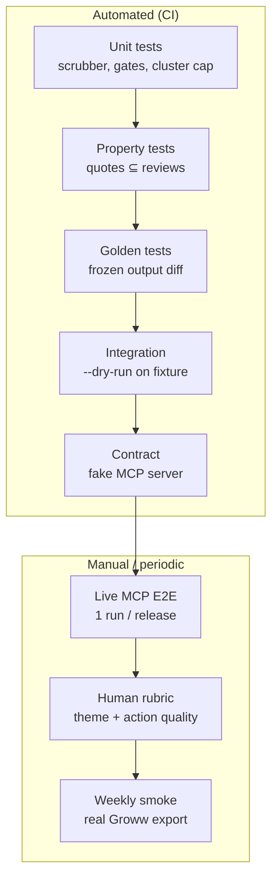

# Evaluation Plan — Groww Review Intelligence Agent

> How to measure whether the agent meets requirements and produces a trustworthy weekly pulse.
> Derived from [`implementation-plan.md`](./implementation-plan.md), with traceability to
> [`problemStatement.md`](./problemStatement.md) and [`architecture.md`](./architecture.md).
>
> **Principle:** separate **compliance eval** (hard gates — pass/fail) from **quality eval**
> (human or LLM-as-judge — scored). Compliance must pass before quality is considered.

---

## 1. Evaluation goals

| Goal | Question answered |
| --- | --- |
| **Compliance** | Does every run satisfy the brief's constraints (PII, verbatim quotes, word limit, MCP-only publish)? |
| **Correctness** | Are theme counts, dates, and quote provenance factually accurate? |
| **Quality** | Would Product / Support / Leadership find the pulse useful and actionable? |
| **Reliability** | Does the pipeline succeed consistently across re-runs, weeks, and config changes? |
| **Operability** | Can a new developer reproduce a passing eval from a fresh clone? |

---

## 2. Evaluation layers

Aligned with the implementation plan test pyramid (§7.2):



| Layer | When it runs | Blocks merge? | Phase introduced |
| --- | --- | --- | --- |
| Unit | Every PR | Yes | 1–3 |
| Property | Every PR | Yes | 3, 5 |
| Golden | Every PR | Yes | 5 |
| Integration (`--dry-run`) | Every PR | Yes | 3, 5 |
| Contract (MCP) | Every PR | Yes | 4, 5 |
| Live MCP E2E | Pre-release / manual | Yes for release | 4 |
| Human quality rubric | Weekly or pre-release | Advisory | 2–3 |
| Smoke on real export | Weekly cron | Alert only | 5 |

---

## 3. Compliance eval (hard gates)

These are **binary**. Any failure = run does not ship.

### 3.1 Requirement → gate mapping

| # | Brief requirement | Automated check | Module / test |
| --- | --- | --- | --- |
| R1 | Play Store import (8–12 weeks) | `window_declared` + ingest row count > 0 | `test_window_declared`, `test_ingest` |
| R2 | No PII in artifacts | `no_pii` on DB + rendered note | `test_scrubber.py`, `test_validate.py` |
| R3 | ≤ 5 themes | `themes_capped`: `len(themes) <= 5` | `test_cluster_cap.py` |
| R4 | Top 3 themes in pulse | `themes_capped`: `len(top_themes) == 3` | `test_validate.py` |
| R5 | 3 verbatim quotes | `quotes_verbatim` + `quotes_count` | `test_quotes_property.py` |
| R6 | 3 grounded action ideas | `actions_grounded` | `test_validate.py` |
| R7 | ≤ 250 words | `word_count` | `test_word_count.py` |
| R8 | Google Docs via MCP | Contract + live E2E | `test_mcp_publish.py` |
| R9 | Gmail draft via MCP | Contract + live E2E | `test_mcp_publish.py` |
| R10 | No direct Google API | Static grep / import lint | `test_no_google_sdk.py` |

### 3.2 Gate pass criteria (per run)

Recorded in `runs/<run_id>/manifest.json` under `gate_results`:

```json
{
  "gate_results": {
    "themes_capped": { "pass": true },
    "quotes_verbatim": { "pass": true, "checked": 3 },
    "quotes_count": { "pass": true },
    "actions_grounded": { "pass": true },
    "word_count": { "pass": true, "value": 218, "limit": 250 },
    "no_pii": { "pass": true, "patterns_checked": 6 },
    "window_declared": { "pass": true, "requested_weeks": 12, "actual_weeks": 11.2 }
  },
  "all_passed": true
}
```

**Ship criterion:** `all_passed === true` AND (for live runs) `publish_result.doc_id` and
`publish_result.draft_id` are non-null.

---

## 4. Phase-wise eval checklist

Use at the end of each implementation phase before moving on.

### Phase 0 — Bootstrap

| ID | Eval | Method | Pass |
| --- | --- | --- | --- |
| E0.1 | CLI boots | `python -m reviewpulse.cli --help` exits 0 | ☐ |
| E0.2 | Layout matches plan | Manual dir compare vs implementation plan §2.1 | ☐ |
| E0.3 | No secrets committed | `git grep` for API keys in tracked files | ☐ |
| E0.4 | Sample export available | File exists in `data/raw/` (local, git-ignored) | ☐ |

### Phase 1 — Ingestion & storage

| ID | Eval | Method | Pass |
| --- | --- | --- | --- |
| E1.1 | Real export ingests | `reviewpulse ingest --file <export>` | ☐ |
| E1.2 | PII scrubber coverage | `pytest tests/unit/test_scrubber.py` — 100% of fixture patterns | ☐ |
| E1.3 | Author never persisted | SQL query: no `author` column / values | ☐ |
| E1.4 | Idempotent re-import | Second ingest: `deduped_count` ≈ row count | ☐ |
| E1.5 | Window filter accurate | Known fixture: only in-range dates in DB | ☐ |
| E1.6 | Manifest window honest | `actual_weeks` not overstated vs data | ☐ |

### Phase 2 — Clustering & labeling

| ID | Eval | Method | Pass |
| --- | --- | --- | --- |
| E2.1 | Theme count cap | `pytest tests/unit/test_cluster_cap.py` | ☐ |
| E2.2 | 3–5 themes on real data | `reviewpulse cluster` on Groww export | ☐ |
| E2.3 | Sizes from data | Spot-check: `theme.size` == DB count for `review_ids` | ☐ |
| E2.4 | Labels are noun phrases | Human spot-check ≥ 3/5 themes sensible (see §6) | ☐ |
| E2.5 | Embedding cache hit | Second cluster run faster; cache file present | ☐ |
| E2.6 | Keyword fallback | Run with embeddings disabled; still ≤ 5 themes | ☐ |
| E2.7 | Reproducibility | Same seed + data → same cluster assignments | ☐ |

### Phase 3 — Pulse synthesis

| ID | Eval | Method | Pass |
| --- | --- | --- | --- |
| E3.1 | Dry-run completes | `reviewpulse run --dry-run` exit 0 | ☐ |
| E3.2 | All 7 gates pass | `manifest.gate_results.all_passed` | ☐ |
| E3.3 | Quote property test | `pytest tests/unit/test_quotes_property.py` | ☐ |
| E3.4 | Word count ≤ 250 | `note.md` word count | ☐ |
| E3.5 | Required sections present | Top themes, quotes, actions in template | ☐ |
| E3.6 | Gate failure aborts | Inject bad fixture → run exits non-zero, no `note.md` publish | ☐ |
| E3.7 | Retry recovers word count | Mock LLM long output → retry → pass (or abort after 1) | ☐ |

### Phase 4 — MCP publishing

| ID | Eval | Method | Pass |
| --- | --- | --- | --- |
| E4.1 | Docs created via MCP | Live run: doc URL opens with pulse content | ☐ |
| E4.2 | Gmail draft via MCP | Draft in mailbox with note or link | ☐ |
| E4.3 | Idempotent re-run | Second run same week: no duplicate doc/draft | ☐ |
| E4.4 | Tool discovery fail-fast | Bad config → error before LLM call | ☐ |
| E4.5 | Partial failure recovery | Simulate Gmail fail → retry reuses doc | ☐ |
| E4.6 | No google SDK in repo | `pytest tests/unit/test_no_google_sdk.py` | ☐ |
| E4.7 | Contract tests | `pytest tests/contract/` | ☐ |

### Phase 5 — Hardening

| ID | Eval | Method | Pass |
| --- | --- | --- | --- |
| E5.1 | Full test suite | `pytest` all green | ☐ |
| E5.2 | Fresh clone repro | New env + README → `--dry-run` succeeds | ☐ |
| E5.3 | Golden stable | `pytest tests/golden/` with pinned LLM stub | ☐ |
| E5.4 | Manifest complete | All fields from architecture §10 present | ☐ |
| E5.5 | Acceptance checklist | problemStatement §9 — all 10 items | ☐ |

---

## 5. Automated test suite map

| Test file | Eval type | What it proves |
| --- | --- | --- |
| `tests/unit/test_scrubber.py` | Compliance | PII patterns redacted; false positives avoided |
| `tests/unit/test_cluster_cap.py` | Compliance | `k <= 5` always |
| `tests/unit/test_word_count.py` | Compliance | Counter matches renderer output |
| `tests/unit/test_validate.py` | Compliance | Each gate pass/fail behavior |
| `tests/unit/test_quotes_property.py` | Correctness | ∀ quotes: `text in review.text_clean` |
| `tests/unit/test_no_google_sdk.py` | Compliance | No forbidden imports |
| `tests/golden/test_pulse_output.py` | Regression | Stable note structure on frozen input |
| `tests/integration/test_dry_run.py` | E2E (local) | Full pipeline on fixture export |
| `tests/contract/test_mcp_publish.py` | Integration | MCP payloads, idempotency, retries |

### 5.1 Running automated eval

```bash
# Full compliance suite (CI)
pytest tests/unit tests/golden tests/integration tests/contract -v

# Fast pre-commit subset
pytest tests/unit -v

# Integration only (needs fixture + LLM key or stub)
pytest tests/integration/test_dry_run.py -v

# Contract only (no live MCP)
pytest tests/contract/ -v
```

### 5.2 CI policy (recommended)

| Job | Command | On failure |
| --- | --- | --- |
| `unit` | `pytest tests/unit` | Block merge |
| `golden` | `pytest tests/golden` | Block merge |
| `integration` | `pytest tests/integration` with stubbed LLM | Block merge |
| `contract` | `pytest tests/contract` | Block merge |
| `live-mcp` | `reviewpulse run` | Manual / nightly only; do not block PRs |

---

## 6. Human quality eval (rubric)

Compliance does not guarantee a *useful* pulse. Run this rubric weekly or before release on
`runs/<run_id>/note.md` + `clusters.json`.

### 6.1 Theme label quality

Score each of the top 3 themes **1–5**:

| Score | Criteria |
| --- | --- |
| 5 | Label clearly names user concern; matches sample reviews; Groww-relevant (KYC, SIP, etc.) |
| 3 | Understandable but vague ("App issues") or slightly over-generalized |
| 1 | Misleading, hallucinated, or unrelated to cluster content |

**Pass threshold:** mean ≥ 3.5 across top 3 themes; no theme scored 1.

**Evaluator:** Product or engineer with Groww domain context.  
**Time:** ~5 minutes.

### 6.2 Quote representativeness

Score each of 3 quotes **1–5**:

| Score | Criteria |
| --- | --- |
| 5 | Captures theme sentiment; specific enough to be informative; readable |
| 3 | On-theme but generic ("Good app" / "Bad experience") |
| 1 | Off-theme or too degraded by `[phone]`/`[email]` placeholders |

**Pass threshold:** mean ≥ 3.0; at least 2/3 quotes ≥ 3.

### 6.3 Action idea quality

Score each of 3 actions **1–5**:

| Score | Criteria |
| --- | --- |
| 5 | Concrete, feasible next step; clearly tied to cited theme; actionable by a team |
| 3 | Directionally right but vague ("Improve UX") |
| 1 | Generic platitude or unrelated to themes |

**Pass threshold:** mean ≥ 3.5; each action cites a valid theme (already enforced by gate).

### 6.4 Pulse usefulness (stakeholder lens)

One score per audience — **1–5** (optional narrative comment):

| Audience | Question |
| --- | --- |
| Product / Growth | "Could I prioritize a sprint item from this alone?" |
| Support | "Does this reflect what users are actually saying?" |
| Leadership | "Can I scan this in under 2 minutes and grasp health?" |

**Pass threshold:** mean ≥ 3.5 across audiences.

### 6.5 Human eval record template

Save as `runs/<run_id>/human_eval.json`:

```json
{
  "run_id": "2026-08-31T06:00:00Z",
  "evaluator": "name",
  "theme_scores": [4, 5, 3],
  "quote_scores": [4, 3, 4],
  "action_scores": [5, 4, 3],
  "stakeholder_scores": { "product": 4, "support": 4, "leadership": 5 },
  "pass": true,
  "notes": "Theme 3 label could be sharper."
}
```

---

## 7. Correctness metrics (automated, per run)

Extract from `manifest.json` for dashboards or week-over-week comparison.

| Metric | Formula / source | Healthy range |
| --- | --- | --- |
| `review_count` | Accepted reviews in window | ≥ 50 (warn if lower) |
| `actual_coverage_weeks` | `window_end - window_start` | 8–12 (warn if < 8) |
| `theme_count` | `len(themes)` | 3–5 |
| `top3_share` | Sum of top 3 theme sizes / total | 0.4–0.95 |
| `avg_rating` | Mean rating in window | Informational |
| `scrub_rate` | Reviews with any `scrub_flags` / total | < 0.15 typical |
| `word_count` | Rendered note | 150–250 |
| `gate_retry_count` | Compose/quote retries | 0 preferred; ≤ 1 acceptable |
| `clustering_mode` | `embedding` or `keyword_fallback` | `embedding` preferred |
| `publish_latency_ms` | Docs + Gmail MCP calls | Informational |
| `idempotent_reuse` | Doc/draft updated vs created | `true` on re-run |

### 7.1 Regression alerts

| Condition | Severity | Action |
| --- | --- | --- |
| `review_count` drops > 40% week-over-week | Warn | Check export freshness |
| `scrub_rate` > 0.30 | Warn | Inspect for new PII pattern |
| `gate_retry_count` > 1 | Warn | Tune prompts |
| `clustering_mode: keyword_fallback` | Info | Restore embedding path |
| Any gate `pass: false` | Critical | Do not publish |

---

## 8. Golden dataset eval

### 8.1 Purpose

Detect unintended changes to renderer, gates, or stubbed LLM output without calling a live model.

### 8.2 Dataset layout

```
tests/golden/
├─ input/
│  └─ frozen_reviews.json      # 30–50 synthetic reviews, fixed seed
├─ expected/
│  ├─ note.md                  # Approved pulse output
│  ├─ clusters.json            # Theme assignments (embedding stubbed or fixed)
│  └─ manifest_snippet.json    # Gate results only
└─ test_pulse_output.py
```

### 8.3 Golden eval rules

- LLM calls **stubbed** in golden tests (fixed `ThemeLabel` + `ActionIdea` responses).
- Diff `note.md` with normalized whitespace; fail on structural or quote text change.
- Update golden files only via explicit PR with reviewer sign-off.

### 8.4 Pass criterion

```bash
pytest tests/golden/test_pulse_output.py -v
# exit 0
```

---

## 9. Integration eval (`--dry-run`)

### 9.1 Fixture

Use `tests/fixtures/groww_sample_export.csv` (anonymized subset of real export or fully synthetic).

### 9.2 Procedure

```bash
reviewpulse ingest --file tests/fixtures/groww_sample_export.csv
reviewpulse run --dry-run --window-weeks 12
```

### 9.3 Assertions (in `test_dry_run.py`)

1. Exit code 0.
2. `runs/<latest>/note.md` exists.
3. `manifest.gate_results.all_passed` is true.
4. `note.md` contains strings matching top theme labels from `clusters.json`.
5. All three quotes appear verbatim in `note.md`.

---

## 10. Live MCP eval (pre-release)

**Frequency:** once per release or after MCP config change. **Not** in default CI.

### 10.1 Procedure

1. Configure live Docs + Gmail MCP in `config/settings.toml`.
2. Run `reviewpulse run --window-weeks 12`.
3. Complete checklist E4.1–E4.7 (§4).
4. Archive `runs/<run_id>/` as release artifact.

### 10.2 Live eval record

| Check | Pass |
| --- | --- |
| Doc URL loads; content matches `note.md` | ☐ |
| Gmail draft exists; recipient correct | ☐ |
| Re-run same week updates (no duplicate) | ☐ |
| `manifest.publish_result` has `doc_id`, `draft_id`, `doc_url` | ☐ |
| No OAuth code paths invoked in app logs | ☐ |

---

## 11. LLM / LangChain eval (optional)

For prompt iteration during Phases 2–3. Enable via LangSmith (`LANGCHAIN_TRACING_V2=true`).

| Signal | What to inspect |
| --- | --- |
| Label chain inputs | Sample reviews match cluster membership |
| Label chain outputs | No invented features; labels < 8 words |
| Compose chain outputs | 3 actions returned; theme_ids valid before render |
| Retry traces | Retries only on gate failure, max 1 |
| Token usage | Stable week-over-week for same review count |

**Pass (dev):** no unbounded retry loops; structured output parse errors < 5% on 10 trial runs.

---

## 12. Eval by implementation-plan risk register

Maps implementation plan §9 risks to eval coverage.

| Risk | Eval that catches it |
| --- | --- |
| Export format mismatch | E1.1, integration fixture |
| MCP tool name mismatch | E4.4, contract tests |
| LLM paraphrases quotes | `quotes_verbatim` gate, property test |
| Sparse reviews → weak themes | E2.2, `review_count` metric |
| Note > 250 words | `word_count` gate, E3.4 |
| PII leak via LLM | `no_pii` gate, scrubber tests |
| Embedding download fail | E2.6 fallback eval |
| Duplicate docs on re-run | E4.3, contract idempotency test |

---

## 13. Final release eval scorecard

Complete before marking the project done (implementation plan §8 + problem statement §9).

### 13.1 Automated (must be 100%)

| Category | Command / check | Status |
| --- | --- | --- |
| Unit tests | `pytest tests/unit` | ☐ |
| Property tests | `pytest tests/unit/test_quotes_property.py` | ☐ |
| Golden tests | `pytest tests/golden` | ☐ |
| Integration | `pytest tests/integration` | ☐ |
| Contract | `pytest tests/contract` | ☐ |
| All gates on dry-run | `manifest.all_passed` | ☐ |
| No Google SDK | `test_no_google_sdk.py` | ☐ |

### 13.2 Manual (must pass once)

| Category | Check | Status |
| --- | --- | --- |
| Live MCP E2E | §10 | ☐ |
| Human rubric | §6 — mean scores above thresholds | ☐ |
| Fresh clone | README → dry-run | ☐ |
| Acceptance §9 | All 10 items | ☐ |

### 13.3 Sign-off

| Role | Name | Date | Eval run ID |
| --- | --- | --- | --- |
| Implementer | | | `runs/...` |
| Reviewer | | | |

---

## 14. Weekly operational eval (post-launch)

After the agent runs on a schedule:

```bash
# After each weekly cron
reviewpulse run --window-weeks 12
python scripts/eval_manifest.py runs/<run_id>/manifest.json   # optional helper
```

| Step | Action |
| --- | --- |
| 1 | Confirm `gate_results.all_passed` |
| 2 | Compare `review_count` and `top3_share` to prior week |
| 3 | Spot-check one quote in Play export source |
| 4 | Optional: 5-min human rubric on themes/actions |
| 5 | If any Critical alert (§7.1): hold draft; do not forward to stakeholders |

---

## 15. What eval does *not* cover (v1)

| Gap | Why omitted | Future eval |
| --- | --- | --- |
| App Store reviews | Out of scope | Separate adapter + fixture |
| Causal impact of action ideas | Requires product telemetry | A/B or ticket linkage |
| LLM-as-judge automation | Cost + setup | LangSmith evaluators |
| Multilingual label quality | Manual only for v1 | Per-language rubric |
| Sentiment accuracy vs stars | Not in brief | Calibration study |

---

## 16. Quick reference

| I want to… | Run |
| --- | --- |
| Verify compliance before merge | `pytest tests/unit tests/golden tests/integration tests/contract` |
| Check pulse locally | `reviewpulse run --dry-run` |
| Validate MCP integration | `pytest tests/contract` then §10 live checklist |
| Score quality for stakeholders | §6 rubric → `human_eval.json` |
| Prove release readiness | §13 scorecard |
| Monitor weekly health | §14 + manifest metrics §7 |
