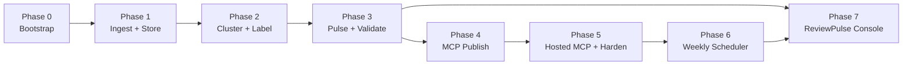
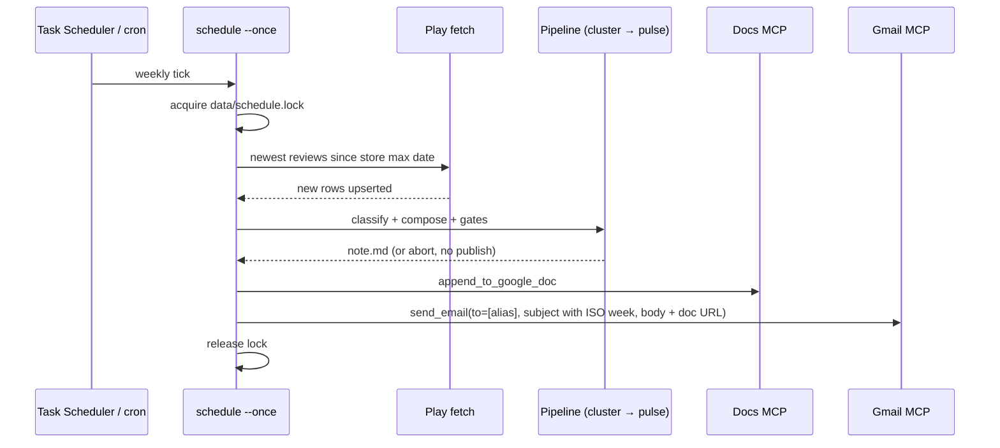

# Implementation Plan — Groww Review Intelligence Agent

> Phase-wise build guide derived from [`problemStatement.md`](./problemStatement.md) and
> [`architecture.md`](./architecture.md).
>
> **Strategy:** complete and validate the full pulse pipeline locally (Phases 1–3) before
> wiring MCP (Phase 4). Phase 5 points the agent at the hosted Gmail/Docs MCP server and
> hardens with tests plus a runbook. Phase 6 puts that run on a weekly schedule: fetch
> **new** reviews, classify, generate the pulse, append it to the Google Doc, and **send**
> the email — no human in the loop. Phase 7 is the operator console: a Next.js + Tailwind
> app that rebuilds [`stitch_grow_final_design/`](../stitch_grow_final_design/) as a real
> product, bound to the SQLite store and `runs/` artifacts — not a restyle of the HTML
> mocks, and not a second pipeline.

---

## 1. Overview

### 1.1 Goal

Deliver a weekly, scriptable agent that:

1. Imports **Google Play Store** reviews for Groww (`com.nextbillion.groww`) from a public export.
2. Clusters them into ≤ 5 themes and surfaces the top 3.
3. Produces a ≤ 250-word pulse with 3 verbatim quotes and 3 action ideas.
4. Publishes to **Google Docs** and creates a **Gmail draft** — both via **MCP**, never direct
   Google API calls. (On-demand `reviewpulse run`; Phase 4–5.)
5. On a **weekly schedule**, fetches only the reviews that arrived since the last run, re-runs
   classify → pulse, **appends** the note to the Google Doc, and **sends** it by email
   (Phase 6). Analysis still uses the rolling 8–12 week window; fetch is incremental.
6. Exposes that work in a **ReviewPulse console** (Phase 7): Next.js + Tailwind, rebuilt from
   the Stitch design, reading the same store and run artifacts the CLI uses.

### 1.2 Phases at a glance

| Phase | Focus | Duration (est.) | Depends on |
| --- | --- | --- | --- |
| **0** | Project bootstrap & prerequisites | 0.5–1 day | — |
| **1** | Ingestion, PII scrubbing, SQLite store | 2–3 days | Phase 0 |
| **2** | Embeddings, clustering, LangChain theme labeling | 2–3 days | Phase 1 |
| **3** | Quote selection, pulse composition, validation gates | 2–3 days | Phase 2 |
| **4** | MCP publishing (Docs + Gmail), idempotency | 2–3 days | Phase 3 |
| **5** | Hosted MCP integration, tests, README runbook | 1–2 days | Phase 4 |
| **6** | Weekly scheduler (fetch new → classify → pulse → Doc + send mail) | 1–2 days | Phase 5 |
| **7** | ReviewPulse console (Next.js + Tailwind from Stitch) | 5–7 days | Phase 3 (data); Phase 6 (live run / publish) |

**Total estimate:** ~16–24 working days for a single developer.

### 1.3 Phase dependency graph



### 1.4 Requirement traceability

| Brief requirement | Primary phase |
| --- | --- |
| Import 8–12 weeks of Play Store reviews | Phase 1 |
| No PII in artifacts | Phase 1 (scrubber) + Phase 3 (`no_pii` gate) |
| ≤ 5 themes, top 3 in pulse | Phase 2 + Phase 3 |
| 3 verbatim quotes | Phase 3 |
| 3 action ideas | Phase 3 |
| ≤ 250 words | Phase 3 |
| Google Docs via MCP | Phase 4 |
| Gmail draft via MCP | Phase 4 |
| Unattended weekly: fetch new reviews → classify → pulse | Phase 6 |
| Pulse appended to Google Doc **and sent** by email | Phase 6 |
| Operator console matching Stitch (pulse, themes, reviews, pipeline, runs, publish, settings) | Phase 7 |

---

## 2. Phase 0 — Project Bootstrap

**Objective.** Runnable Python project skeleton, dependency pins, config templates, and a minimal CLI
entry point — no business logic yet.

### 2.1 Tasks

| # | Task | Output |
| --- | --- | --- |
| 0.1 | Initialize `pyproject.toml` / `requirements.txt` with Python 3.11+ | Dependency manifest |
| 0.2 | Pin core packages: `mcp`, `langchain-core`, `langchain-groq`, `pydantic`, `scikit-learn`, `numpy`, `sentence-transformers` (or chosen embedder) | `pyproject.toml` |
| 0.3 | Create directory layout per architecture §4 | `src/reviewpulse/`, `config/`, `data/`, `tests/`, `runs/` |
| 0.4 | Add `config/settings.example.toml` — window weeks, `k_max=5`, recipient alias placeholder, MCP server command stubs | Example config |
| 0.5 | Add `config/taxonomy.example.toml` — fallback keyword themes (placeholders; **replaced in Phase 2 task 2.10** with the buckets measured on real data, §4.5) | Fallback taxonomy |
| 0.6 | Add `.gitignore` — `data/`, `runs/`, `config/settings.toml`, `.env`, `__pycache__/`, `.venv/` | Git hygiene |
| 0.7 | Implement `models.py` — Pydantic/dataclass stubs for `RawReview`, `Review`, `Theme`, `Quote`, `ActionIdea`, `PulseNote`, `PublishResult` | Typed data model |
| 0.8 | Implement `cli.py` with `--help`, `--dry-run`, `--window-weeks` flags (no-op body) | CLI skeleton |
| 0.9 | Add `.env.example` — `GROQ_API_KEY`, optional `LLM_MODEL` override and LangSmith vars | Env template |
| 0.10 | Obtain or place a sample Play Store export in `data/raw/` for development | Dev fixture |

### 2.2 Dependencies to install

```text
mcp
langchain-core
langchain-groq            # Groq free tier, ADR-8
langchain-mcp-adapters    # optional; Phase 4
pydantic>=2
scikit-learn
numpy
sentence-transformers     # or alternative embedding backend
pytest
```

### 2.3 Exit criteria

- [ ] `python -m reviewpulse.cli --help` runs without error.
- [ ] Project layout matches architecture §4.
- [ ] `config/settings.example.toml` and `.env.example` are committed; secrets are not.
- [ ] At least one sample Play export file exists locally (git-ignored).

### 2.4 Blockers to resolve early

| Open question | Action in Phase 0 |
| --- | --- |
| Which Play Store export format? | Inspect sample file headers; document field mapping in a comment at top of `play_export.py` (Phase 1) |
| LLM provider | Groq free tier per ADR-8; model and quotas in `config/settings.toml` `[llm]` |

---

## 3. Phase 1 — Ingestion, PII Scrubbing & Storage

**Objective.** Read a public Play Store export, normalize it, scrub PII, persist scrubbed reviews in
SQLite. No LLM, no clustering.

**Maps to:** problem statement §3 (import reviews), §6 (no PII, public exports); architecture
ADR-3, ADR-7, §6.1–6.2.

### 3.1 Tasks

| # | Task | Module | Notes |
| --- | --- | --- | --- |
| 1.0 | Implement public review downloader | `sources/play_fetch.py` | Pages the public Play reviews endpoint newest-first; no credentials; writes export CSV to `data/raw/`; drops reviewer name; flags partial coverage |
| 1.1 | Define `ReviewSource` protocol | `sources/base.py` | `fetch(window) -> Iterable[RawReview]` |
| 1.2 | Implement Play Store CSV/JSON adapter | `sources/play_export.py` | Map export columns → `RawReview`; `source="play"` |
| 1.3 | Implement normalizer | `sources/normalize.py` | UTC dates, clamp ratings 1–5, drop empty text, language detect |
| 1.3a | Quality filters | `sources/language.py` | Drop reviews under `min_words` (default 8) and non-English reviews (script + romanized-Indic + English-lexicon signals) |
| 1.4 | Implement window filter | `sources/normalize.py` | Default 12 weeks; record actual min/max dates |
| 1.5 | Implement PII scrubber | `privacy/scrubber.py` | Drop `author`; redact emails, phones, long digit runs, UUIDs, `@handles`, URLs with query strings |
| 1.6 | Track `scrub_flags` per review | `privacy/scrubber.py` | List of redaction types applied |
| 1.7 | Compute `review_id` hash | `store/sqlite.py` | `sha256(source \| external_id \| date)` or text fallback |
| 1.8 | SQLite schema + upsert | `store/sqlite.py` | Table `reviews` with scrubbed fields only |
| 1.9 | Window query API | `store/sqlite.py` | `get_reviews(window_start, window_end) -> list[Review]` |
| 1.10 | Wire ingest stage in orchestrator | `orchestrator.py` | `ingest → normalize → scrub → store` |
| 1.11 | CLI: `reviewpulse ingest --file data/raw/<export>` | `cli.py` | Standalone ingest command for debugging |

### 3.2 PII scrubber test cases (required)

Create `tests/fixtures/pii_reviews.json` with rows covering:

| Pattern | Expected |
| --- | --- |
| `user@example.com` in text | Replaced with `[email]`; flag `email` |
| `+91 98765 43210` | Replaced with `[phone]` |
| 12+ digit account number | Replaced with `[number]` |
| `@username` handle | Replaced with `[handle]` |
| Normal product feedback, no PII | Unchanged |
| `author` field on `RawReview` | Never written to DB |

### 3.3 Exit criteria

- [x] Real Play export ingested into `data/reviews.db` (1,260 English reviews of 8+ words,
  filtered from 8,674 downloaded, 2026-07-06 → 2026-08-29).
- [x] DB contains **zero** `author` or raw PII columns.
- [x] Re-importing the same file is idempotent (no duplicate `review_id`s).
- [x] Window filter returns only reviews within the requested range.
- [x] Manifest records requested vs. actual date range.
- [x] All scrubber unit tests pass (`pytest tests/unit/test_scrubber.py`).

### 3.4 Acceptance checklist items satisfied

- [x] Play Store reviews imported from public export (partial — ingest only)
- [x] No PII in stored data

---

## 4. Phase 2 — Embeddings, Clustering & Theme Labeling

**Objective.** Group scrubbed reviews into ≤ 5 themes using embeddings + agglomerative clustering;
name each theme with a LangChain structured-output chain.

**Maps to:** problem statement §3 (≤ 5 themes); architecture ADR-4, ADR-6, §6.4–6.5.

> **Revised after Phase 1.** This section was rewritten against the real corpus in
> `data/exports/play_store.csv` (1,260 reviews). Clustering experiments on that corpus invalidated
> three assumptions in the original plan: cosine/average linkage, ranking clusters by size, and
> embedding `title_clean + text_clean`. §4.1 records the measurements; §4.2–4.3 are the corrected
> design.

### 4.1 What the Phase 1 data actually looks like

Corpus: 1,260 English reviews, **2026-07-06 → 2026-08-29** (8 ISO weeks, 110–196 reviews per week).

| Property | Measured value | Consequence for Phase 2 |
| --- | --- | --- |
| Rating distribution | 1★ 502 (39.8%), 2★ 81 (6.4%), 3★ 107 (8.5%), 4★ 100 (7.9%), 5★ 470 (37.3%); mean **2.96** | Strongly bimodal. Embeddings split on sentiment before topic (see §4.2 F2) |
| Review length | median **17** words, p25 11, p75 34, p90 57, max 98, mean 25.3 (mean 144 chars) | Short text → weak embedding signal; no chunking needed |
| `title_clean` | **empty on all 1,260 rows** (public Play endpoint returns no title) | Drop title from the embedding input — `text_clean` only |
| Low-information praise | **286 rows (22.7%)** are ≤ 12 words and 4–5★ ("super app nice ❤️") | Must be filtered before clustering, else it dominates |
| `scrub_flags` | only **9 rows** flagged (6 `phone`, 3 `handle`) | PII is rare; `no_pii` gate is cheap but keep it |
| Duplicate texts | **0** exact duplicates | No dedupe stage needed |
| Language | 100% `en` after Phase 1 filters | No per-language clustering |
| Quote supply | **691** reviews in the 12–45 word band (283 at 1★, 228 at 5★) | Ample quote candidates for every candidate theme (min 15) |

### 4.2 Clustering experiment results (run on the real export)

Embedding: `sentence-transformers/all-MiniLM-L6-v2`, 384-d, L2-normalized, 1,260 reviews in ~30 s
on CPU including model load.

| Configuration | Silhouette (cosine) | Resulting cluster sizes | Verdict |
| --- | --- | --- | --- |
| **Agglomerative, cosine + average, k=5** (as originally planned) | 0.091 | **1243 / 12 / 2 / 2 / 1** | **Fails** — one mega-cluster |
| Same, complaints only (rating ≤ 3, n=690) | 0.098 | **676 / 5 / 4 / 4 / 1** | **Fails** — subsetting does not help |
| Agglomerative, **ward**, k=5, full corpus | 0.062 | 373 / 328 / 221 / 205 / 133 | Balanced, partly sentiment-driven |
| Agglomerative, **ward**, k=5, **signal subset** (n=855) | 0.043 | 279 / 201 / 158 / 148 / **69** | **Best** — isolates the actionable cluster |
| Agglomerative, ward, k=6, signal subset | 0.050 | 218 / 201 / 158 / 148 / 69 / 61 | Splits support vs. withdrawals; over `k_max` |
| KMeans, k=5, full corpus | 0.068 | 320 / 289 / 234 / 224 / 193 | Balanced but clusters ≈ sentiment bands |
| Keyword taxonomy (Groww-specific, §4.5) | n/a | 34–304 per bucket, 64.8% coverage | Viable fallback only |

**Findings that change the design:**

| # | Finding | Design change |
| --- | --- | --- |
| **F1** | Cosine + average linkage puts 98.7% of reviews in one cluster on this corpus, at every k from 2 to 8 and on every subset tried. Silhouette is *highest* for this useless partition, so silhouette cannot be the selection metric. | Use **ward** linkage on L2-normalized vectors. Add a **balance guard**: no cluster may exceed 60% of clustered reviews, else fall back (§4.3 task 2.5). |
| **F2** | Peak silhouette across all balanced configurations is **0.043–0.068** — the embedding space is only weakly separable, and KMeans clusters align with rating band rather than topic (mean ratings 1.49 / 2.67 / 3.09 / 4.00 / 4.25 at k=5). | Themes are not reliably topical from embeddings alone. Pass keyword anchors into the label prompt and force it to name a *product surface*, not a sentiment (task 2.13). |
| **F3** | 22.7% of the corpus is short generic praise; on the full corpus it forms its own cluster (n=133, mean rating **4.68**: "easy, platform, interface, beginners"). | Add a **pre-cluster signal filter** (task 2.1): keep `rating <= 3 or word_count >= 20` → **855 of 1,260 (67.9%)**, dropping 405 low-information rows. |
| **F4** | Ranking by size promotes the least actionable themes. Under the keyword taxonomy, size ranks `charts_trading_ux` (n=304, 40% negative) and `ease_of_use_praise` (n=195, mean rating **4.62**) into the top 2, while `support_escalation` (n=134, **91.8% negative**, mean rating **1.31**) ranks 4th. | Replace size ranking with a **severity-weighted priority** = `size × negative_share` (task 2.6). That reorders to support → charts/UX → charges → withdrawals → feature gaps. Keep `size` as reported evidence. |
| **F5** | The sharpest actionable signal is a post-update chart/scalper regression: a crisp 69-review cluster (mean rating 2.26; top terms *chart, scalper, update, open, mode*) that appears **only** at k ≥ 5 on the signal subset. The 17 explicit "scalper" mentions concentrate in ISO weeks 32 (5) and 35 (8) vs. 4 in weeks 28–31. | Cluster at `k=5` on the signal subset (not the full corpus), and compute a **week-over-week trend** per theme (task 2.8) so recent spikes are visible in the pulse instead of being averaged away. |
| **F6** | The Phase 0 example taxonomy (`onboarding`, `kyc`, `payments`, `statements`, `withdrawals`) barely matches the corpus: KYC/login is **2.9%** and onboarding is near-absent, while charges, support, charts/UX and update regressions — the actual volume — have no bucket. | Replace `config/taxonomy.example.toml` with the measured buckets in §4.5 (task 2.10). |
| **F7** | The Groww-specific taxonomy still leaves **443 reviews (35.2%)** unmatched, and 330 reviews match 2+ buckets. | Keyword mode stays a **fallback only**, must be single-label (highest-priority bucket wins) and needs an explicit `other` bucket. |

### 4.3 Tasks

| # | Task | Module | Notes |
| --- | --- | --- | --- |
| 2.0 | Load window from SQLite | `analysis/select.py` | 1,260 rows for the 2026-07-06 → 2026-08-29 window |
| 2.1 | **Signal filter** before clustering | `analysis/select.py` | Keep `rating <= 3 or word_count >= 20`; expect ~68% retention; record `dropped_low_signal` count in the manifest (F3) |
| 2.2 | Embedding function | `analysis/embed.py` | **`text_clean` only** — `title_clean` is empty on every row (§4.1); normalize to unit length |
| 2.3 | Embedding cache | `analysis/embed.py` | Keyed by `review_id` + model name; ~30 s cold for 1.2k reviews, near-zero warm |
| 2.4 | Agglomerative clusterer | `analysis/cluster.py` | **`linkage="ward"`, euclidean on normalized vectors**, `n_clusters=k_max=5` (F1). Deterministic — no `random_state` needed |
| 2.5 | **Balance guard + fallback ladder** | `analysis/cluster.py` | If any cluster > 60% of members, descend: ward → KMeans(k=5, seed=42) → keyword taxonomy → `catch_all`. The guard is skipped when `k=1`, where one cluster is the request rather than a collapse. Every rung and its rejection reason is logged (F1) |
| 2.6 | **Severity-weighted ranking** | `analysis/cluster.py` | `neg_share = share of members with rating <= 2`; `priority = size * neg_share`; `rank` = 1..n by `priority` desc, ties by size (F4) |
| 2.7 | Tiny-cluster merge rule | `analysis/cluster.py` | Fold clusters below `cluster_size_floor` into nearest centroid. Floor of 3 is inert here (smallest observed cluster is 61); keep for sparse weeks |
| 2.8 | **Theme trend metric** | `analysis/cluster.py` | Per theme: counts in the first vs. second half of the window (weeks 28–31 vs. 32–35) and `trend = late/early`; flag `emerging` when ratio ≥ 1.5 (F5) |
| 2.9 | Keyword-taxonomy fallback | `analysis/cluster.py` | Read `config/taxonomy.toml`; **single-label** (first match by bucket priority) + `other` bucket for the ~35% unmatched (F7) |
| 2.10 | Rewrite the taxonomy file | `config/taxonomy.example.toml` | Replace the onboarding/KYC/payments placeholders with the measured buckets in §4.5 (F6) |
| 2.11 | Extend `Theme` model | `models.py` | Add `neg_share: float`, `priority: float`, `trend: float \| None`, `keywords: list[str]`, `example_review_ids: list[str]` |
| 2.12 | LLM factory | `llm/factory.py`, `llm/rate_limit.py` | `ChatGroq` (`openai/gpt-oss-120b`) with the free-tier pacer attached (ADR-8) |
| 2.13 | Label prompt template | `prompts/label_themes.yaml` | Constrain to sample content only. **Must name a product surface, not a sentiment** — reject labels like "Positive feedback" or "Bad app" (F2). Pass the cluster's top keyword terms as anchors. All themes in one prompt, keyed by `theme_id`, so the rules also demand labels that tell them apart |
| 2.14 | LangChain label chain | `chains/label_themes.py` | `with_structured_output(ThemeLabels)` once per run, via Groq's strict `json_schema` decoding |
| 2.15 | Wire label stage | `analysis/label.py` | Sample **stratified by rating** — clusters span mean ratings 1.6–4.7, so an unstratified sample misreads mixed clusters. Take the short end of the 12–45 word band, `samples_per_theme` of them. Re-ask only the rejected themes, capping a run at two calls. Attach `size`, `mean_rating`, `neg_share`, `trend` from data, never from the LLM |
| 2.16 | Persist cluster output | `runs/<run_id>/clusters.json` | Labels, member IDs, `size`, `mean_rating`, `neg_share`, `priority`, `rank`, `trend`, top terms |
| 2.17 | **Cluster diagnostics artifact** | `runs/<run_id>/cluster_debug.json` | Silhouette, size histogram, fallback rung used, top 10 terms per cluster — the signal that caught F1 |
| 2.18 | CLI: `reviewpulse cluster` | `cli.py` | Debug command; prints the theme table (label, size, mean rating, neg share, priority, trend) |

### 4.4 Configuration additions

```toml
[llm]
model = "openai/gpt-oss-120b"     # Groq free tier (ADR-8)
reasoning_effort = "low"          # reasoning tokens count against tokens_per_minute
samples_per_theme = 6             # sample reviews per theme — most of the prompt
requests_per_minute = 30          # published free-tier quotas, per model
requests_per_day = 1000
tokens_per_minute = 8000
tokens_per_day = 200000
tokens_per_request = 2500         # estimated cost of one labeling call; sets the pace

[clustering]
mode = "embedding"                # embedding | keyword_fallback
embedding_model = "sentence-transformers/all-MiniLM-L6-v2"
linkage = "ward"                  # was cosine/average — collapsed to one cluster (F1)
random_seed = 42                  # affects label sampling + KMeans fallback only
max_cluster_share = 0.60          # balance guard (F1)
signal_min_words = 20             # keep short reviews only when rating <= 3 (F3)
signal_max_rating = 3
rank_by = "priority"              # priority = size * neg_share (F4)
trend_split_weeks = 4             # last N weeks are the "late" half (F5)
emerging_trend_ratio = 1.5        # late/early ratio that flags a theme emerging
label_llm = true                  # false = deterministic keyword labels, no LLM calls
```

Note that `size × neg_share` reduces exactly to the count of 1–2★ reviews in the cluster, so the
code computes it from that count directly rather than from the rounded share.

### 4.5 Measured taxonomy buckets (fallback mode)

Coverage measured on all 1,260 reviews; `neg%` is the share of the bucket rated ≤ 2.

| Bucket | n | % corpus | Mean rating | neg% | Anchor terms |
| --- | --- | --- | --- | --- | --- |
| `charts_trading_ux` | 304 | 24.1% | 3.15 | 39.8% | chart, scalper, indicator, watchlist, option chain, interface, layout |
| `ease_of_use_praise` | 195 | 15.5% | 4.62 | 6.7% | easy to use, user friendly, beginner, simple |
| `charges_brokerage` | 147 | 11.7% | 2.18 | 66.7% | charges, brokerage, DP charge, AMC, expensive, hidden fee |
| `support_escalation` | 134 | 10.6% | **1.31** | **91.8%** | customer care/support/service, no response, ticket, call back |
| `mutual_funds_sip` | 130 | 10.3% | 3.38 | 34.6% | mutual fund, SIP, SWP, STP, NAV, folio, redemption |
| `feature_gap_competitor` | 114 | 9.0% | 2.66 | 52.6% | zerodha, angel one, upstox, dhan, not available, please add, US stocks |
| `funds_withdrawal` | 94 | 7.5% | 1.71 | 79.8% | withdraw, payout, money stuck/blocked, not credited, refund, UPI |
| `update_regression` | 48 | 3.8% | 1.83 | 70.8% | after update, new version, revert, previous version, reinstall |
| `kyc_login_access` | 46 | 3.7% | 1.96 | 73.9% | KYC, account opening, verification, OTP, login, blocked |
| `execution_data` | 34 | 2.7% | 2.24 | 61.8% | order rejected, square off, stop loss, LTP, wrong P&L, margin |
| `other` | 443 | 35.2% | 3.19 | — | no bucket matched (F7) |

### 4.6 LangChain label chain sketch

```python
# chains/label_themes.py — illustrative
label_chain = (
    ChatPromptTemplate.from_file("prompts/label_themes.yaml")
    | llm.with_structured_output(ThemeLabels)   # every theme in one call
)
```

`ThemeLabels` is `labels: list[ThemeLabelEntry]`, and an entry is `theme_id: str`, `label: str`,
`summary: str` — no `size`, `rank`, `neg_share`, or `priority` (those are computed from the data in
tasks 2.6 and 2.8). `theme_id` is what ties an answer back to its cluster, so a partial answer costs
only the themes it missed.

### 4.7 Exit criteria

- [x] Clustering produces 3–5 themes on the real 1,260-review corpus (5 themes: 279 / 201 / 158 /
      148 / 69).
- [x] `len(themes) <= 5` enforced in code and tested.
- [x] **No cluster exceeds 60% of clustered reviews** — largest is 32.6%; regression test asserts
      average linkage still collapses (>90%) on the same vectors, so the guard stays justified.
- [x] **Signal filter retains 60–75% of the corpus** (855/1,260 = 67.9%).
- [x] The chart/scalper update-regression signal (F5) surfaces as its own theme (rank 5, n=69, terms
      *chart, mode, charts, scalping, button, scalper, update*), not folded into a generic cluster.
- [x] Themes are ranked by `priority`, and no theme whose mean rating > 4.0 occupies rank 1 (rank 1
      is 1.61 mean rating, 81% negative).
- [x] Theme labels name a product surface, not a sentiment — enforced in code (`is_sentiment_label`)
      plus a `labels_distinct` check, both reported in the manifest.
- [x] `size`, `mean_rating`, `neg_share`, and `trend` match DB aggregates, not LLM output.
- [x] Embedding cache makes the second run on the same data measurably faster (~22 s → ~2 s).
- [x] Fallback taxonomy path works when embeddings are disabled, and reports `other`-bucket share.
- [x] `runs/<run_id>/cluster_debug.json` written on every run.
- [x] Unit test: `k_max=5` never exceeded regardless of review count.

Verified by `pytest` (129 tests) and `reviewpulse cluster --window-weeks 8` in both `embedding` and
`keyword_fallback` modes. Two robustness gaps that the tests exposed and the plan had not
anticipated: the balance guard must not reject a single cluster when `k=1` was the request, and the
keyword rung can match nothing at all — a `catch_all` rung now guarantees an auditable artifact.

### 4.8 Acceptance checklist items satisfied

- [x] At most 5 themes produced by clustering

---

## 5. Phase 3 — Pulse Synthesis & Validation Gates

**Objective.** Select 3 verbatim quotes, compose the weekly note via LangChain, render it, and pass
all validation gates — output to `runs/<run_id>/note.md` with **no MCP calls**.

**Maps to:** problem statement §3–4 (top 3 themes, quotes, actions, ≤ 250 words); architecture
ADR-5, ADR-6, §6.6–6.7, §7.

> **Why before MCP:** Every brief constraint can be verified locally. Publishing is the riskiest
> integration; it should only run on a note that is already proven valid.

> **Revised during Phase 3.** Building the selector against the real themes
> exposed three ways a quote can be verbatim, in-cluster and still wrong for the
> note. §5.1a records them; the scoring in `analysis/quotes.py` is the correction.

> **Provider split.** Composition runs on **Gemini** (`gemini-3.6-flash`), not the
> Groq model Phase 2 labels with (architecture ADR-9). The provider moved from a
> global to a property of a settings block — `[llm]` for labeling, `[pulse.llm]`
> for composition — so a quota or outage on one provider degrades one stage
> instead of the run. Task 3.4 and §5.3 below reflect this.

### 5.1 Tasks

| # | Task | Module | Notes |
| --- | --- | --- | --- |
| 3.1 | Select top 3 themes by rank | `analysis/quotes.py` | From clustered output; `rank` is severity-weighted, not size-based (§4.2 F4) |
| 3.2 | Extractive quote selector | `analysis/quotes.py` | Centroid proximity, length, one quote per theme, distinct `review_id`s. Plus rating alignment, distinctive anchors and a redundancy guard (§5.1a) |
| 3.3 | Compose prompt template | `prompts/compose_pulse.yaml` | Themes + stats in; quotes **not** in LLM output path |
| 3.4 | LangChain compose chain | `chains/compose_pulse.py` | Structured output: prose frame + 3 `ActionIdea` objects. Runs on Gemini via `[pulse.llm]` (ADR-9), keyed by `GEMINI_API_KEY` |
| 3.5 | Retry policy | `chains/retry_policy.py` | One bounded retry on gate failure |
| 3.6 | Renderer | `pulse/render.py` | Inject verbatim quotes; format per architecture §6.7 template |
| 3.7 | Word counter | `pulse/render.py` | Count rendered note, not LLM raw output |
| 3.8 | Validation gates | `pulse/validate.py` | All 7 gates from architecture §7 |
| 3.9 | `DryRunPublisher` | `publish/base.py` | Write `note.md` + `publish.json` to `runs/<run_id>/` |
| 3.10 | Wire full pipeline in orchestrator | `orchestrator.py` | ingest → cluster → label → quotes → compose → render → validate → dry-run publish |
| 3.11 | CLI: `reviewpulse run --dry-run` | `cli.py` | End-to-end local run |
| 3.12 | CLI: `reviewpulse pulse` | `cli.py` | Added: `run --dry-run` re-downloads, so Phase 3 could not be iterated on the stored corpus. Mirrors the `cluster` debug command (task 2.18) |

### 5.1a Findings from building against the real themes

| # | Finding | Design change |
| --- | --- | --- |
| **F7** | Centroid proximity plus term density picked a 5★ "very easy to deposit and withdraw money" to illustrate a 1.8★ withdrawal-failure theme. Embeddings separate this corpus by sentiment weakly and by topic weakly (§4.2 F2), so a positive review sits near a complaint centroid on shared vocabulary alone. | Score **rating alignment**: `1 - |quote_pos - theme_pos|` on the 1–5 scale, weight 0.20. Without embeddings it is the only representativeness signal there is; with them it corrects for F2. |
| **F8** | Adjacent themes share anchor terms — `charges` and `trading` anchor both *Charges and brokerage* and *Ease of use for beginners* — so a charges complaint scored as evidence for the ease-of-use theme and two of three quotes said the same thing. | Score density on **distinctive anchors** only: a term appearing in another top theme's anchors distinguishes neither, so it is dropped from both. Falls back to the full list if every term is shared. |
| **F9** | Nothing stopped two themes quoting near-identical complaints, which spends a third of a 250-word note twice. | **Redundancy guard**: skip a candidate whose content-word Jaccard against an already-chosen quote exceeds 0.30. Falls back to the best redundant candidate rather than leaving a theme unquoted, and flags it in the manifest. |
| **F10** | A note that fails a gate is exactly the one someone needs to read, but publishing it is not an option. | Write it to `note.rejected.md`; `note.md` and `publish.json` appear only on a passing run. |

### 5.2 Validation gates to implement

| Gate | Implementation check |
| --- | --- |
| `themes_capped` | `len(all_themes) <= 5` and `len(top_themes) == 3` |
| `quotes_verbatim` | `quote.text in review.text_clean` for each quote |
| `quotes_count` | Exactly 3, distinct `review_id`s |
| `actions_grounded` | 3 actions, each with valid `theme_id` |
| `word_count` | Rendered note `<= 250` words |
| `no_pii` | Re-run scrubber patterns on rendered note; zero matches |
| `window_declared` | Manifest dates match DB query range |

### 5.3 Exit criteria

- [x] `reviewpulse run --dry-run --window-weeks 8` completes without error on real data
      (8,936 downloaded → 878 clustered → 5 themes → a 180-word note, all seven gates green).
- [x] `runs/<run_id>/note.md` exists and is ≤ 250 words — **180**, and 172–180 across every
      run measured in both `embedding` and `keyword_fallback` mode.
- [x] Note contains top 3 themes, 3 quotes, 3 action ideas in the architecture §6.7 format.
- [x] Every quote is verifiably a substring of a stored review — asserted per run by the
      `quotes_verbatim` gate against `store.get_by_id`, and over 100 randomised corpora by
      `tests/unit/test_quotes_property.py` (punctuation-free text, multi-space runs, embedded
      brackets and quote marks, 1–30 word sentences).
- [x] `no_pii` gate passes on rendered output; parametrised against email, phone, long-digit
      and `@handle` leaks, and confirmed not to fire on the `@groww` brand handle.
- [x] Gate failure aborts the run, publishes nothing, and writes `note.rejected.md`; one
      retry is offered for `word_count`, `actions_grounded` and `quotes_count`, and a hard
      failure vetoes the retry even alongside a recoverable one.
- [x] `runs/<run_id>/manifest.json` records themes with member IDs, quotes with their
      selection scores, all 7 gate results, the scrub-flag histogram and the idempotency key —
      extending the cluster manifest rather than replacing it, so one file traces a quote back
      to its review row.

Verified by `pytest` (369 tests, up from 129 at the end of Phase 2) and by
`reviewpulse pulse` and `reviewpulse run --dry-run` on the real corpus.

**Not verified:** the LLM compose path has no live run behind it — no `GEMINI_API_KEY` was
configured in this environment, so every measured run used the deterministic prose frame. The
chain itself is covered by stub-chain unit tests (one call per note, retry prompt, partial
answers, malformed answers, transport errors); what remains unproven is whether a real model
keeps the note under 250 words on the first attempt. The `word_count` retry exists for exactly
that, and §5.1a F10 makes a failure inspectable, but the first live run should be watched.

Structured output was checked against the real client rather than assumed: `langchain-google-genai`
accepts `json_schema` with `strict`, so composition keeps the same constrained-decoding guarantee
labeling has. `structured_output()` still falls back through weaker bindings to function calling, so
a client that supports less degrades instead of failing. Either way a malformed answer is survivable
— `compose.py` drops to the deterministic frame rather than raising, and `compose_provider` /
`compose_model` in the manifest record which model was asked.

### 5.4 Acceptance checklist items satisfied

- [x] Weekly note names top 3 themes
- [x] Exactly 3 verbatim user quotes
- [x] 3 concrete action ideas tied to themes
- [x] Note ≤ 250 words

---

## 6. Phase 4 — MCP Publishing (Google Docs & Gmail)

**Objective.** Replace `DryRunPublisher` with `McpPublisher` that creates/updates a Google Doc and a
Gmail draft via MCP tool calls. Re-runs are idempotent.

**Maps to:** problem statement §2 steps 4–5, §5 (MCP-first); architecture ADR-2, §8.

### 6.1 Tasks

| # | Task | Module | Notes |
| --- | --- | --- | --- |
| 4.1 | MCP client wrapper | `mcp/client.py` | Stdio sessions, `list_tools`, call_tool, retries |
| 4.2 | Tool discovery + schema verify | `mcp/client.py` | Fail fast if configured tool names missing |
| 4.3 | Configure Docs MCP server | `config/settings.toml` | Command, args, tool name mapping |
| 4.4 | Configure Gmail MCP server | `config/settings.toml` | Command, args, tool name mapping |
| 4.5 | `Publisher` protocol | `publish/base.py` | `publish_doc`, `create_draft` |
| 4.6 | Google Docs publisher | `publish/gdocs.py` | Create doc → insert rendered body; return `doc_id`, `url` |
| 4.7 | Gmail publisher | `publish/gmail.py` | Create draft to recipient alias; body includes note + doc link |
| 4.8 | Idempotency key | `publish/base.py` | `groww:<ISO year>-W<week>` in doc title and email subject |
| 4.9 | Update-in-place on re-run | `publish/gdocs.py`, `publish/gmail.py` | Find existing artifact by key before create |
| 4.10 | Partial-failure handling | `orchestrator.py` | Persist `doc_id` before Gmail call; retry reuses doc |
| 4.11 | Optional LangChain MCP bridge | `publish/mcp_langchain.py` | `langchain-mcp-adapters` wrapper — only if chosen over native SDK |
| 4.12 | CLI: `reviewpulse run` (live) | `cli.py` | Full pipeline including MCP publish |
| 4.13 | Contract test with fake MCP server | `tests/contract/test_mcp_publish.py` | Assert tool calls, payloads, idempotency |

### 6.2 MCP configuration checklist

Before first live run:

1. Identify Docs and Gmail MCP servers available in your environment.
2. Run `list_tools` on each; record actual tool names.
3. Fill `config/settings.toml` with commands and tool mappings.
4. Set recipient alias for Gmail draft.
5. Confirm MCP servers handle Google OAuth — not this repo.

### 6.3 Publish sequence

```
validate(note) → publish_doc(note, idempotency_key) → create_draft(note, doc_ref, key) → write manifest
```

Manifest is written **only after both** Docs and Gmail succeed.

### 6.4 Exit criteria

- [x] `reviewpulse run` creates a Google Doc with the weekly pulse content —
      exercised against a fake MCP server (`tests/contract/`); a live server is
      still an operator step (fill `[mcp.*]` and run without `--dry-run`).
- [x] Gmail draft is created via the configured `create_draft` tool, addressed to
      `gmail.recipient_alias`, with the note and doc link in the body.
- [x] Re-running for the same ISO week updates the existing doc/draft — no duplicates.
- [x] MCP tool discovery fails clearly when server is misconfigured (before LLM spend).
- [x] Partial failure (Docs ok, Gmail fail) allows retry without duplicate doc.
- [x] No `googleapiclient` or OAuth code in this repository.
- [x] Contract tests pass against fake MCP server.

Native MCP SDK is the publish path (task 4.11: `langchain-mcp-adapters` was not
chosen; one client, stdio *or* Streamable HTTP). Phase 5 points that client at
the hosted Railway server and its real tool names.

### 6.5 Acceptance checklist items satisfied

- [x] Pulse document created/updated in Google Docs via MCP
- [x] Gmail draft created via MCP
- [x] No direct Google API integration

---

## 7. Phase 5 — Hosted MCP Integration, Tests & Runbook

**Objective.** Talk to the deployed Gmail/Docs MCP server over Streamable HTTP, keep the
Phase 4 stdio path for fakes, finish the test pyramid, and document a weekly run so a
fresh clone can reproduce it.

**Maps to:** architecture §8 and §10–12; problem statement §5 and §9. The live server is
[`mcp-gmail-google-docs-connect`](https://github.com/manojkr-ai-labs/mcp-gmail-google-docs-connect)
at `https://mcp-gmail-google-docs-connect-production.up.railway.app/` (container `PORT=8080`;
clients use HTTPS `/mcp`, not `:8080`).

> **Revised after inspecting the live server.** Phase 4 assumed two stdio processes with
> create/replace/search tools. The Railway service is one Streamable HTTP endpoint that
> **appends** to an existing Doc and **drafts** mail. §7.1 records that contract; §7.2–7.4
> are the corrected client work.

### 7.1 What the hosted MCP server actually exposes

Probed `GET /` → `{ok, name: gmail-docs-mcp, version: 1.0.0, health: /health, mcp: /mcp}`.
`GET /health` is 200 with no auth. `POST /mcp` is **401** without
`Authorization: Bearer <MCP_AUTH_TOKEN>`.

| Property | Hosted server | What Phase 4 assumed |
| --- | --- | --- |
| Process count | **One** combined Gmail + Docs server | Two stdio servers (`[mcp.gdocs]`, `[mcp.gmail]`) |
| Transport | Streamable HTTP `POST /mcp` | stdio spawn (`command` / `args`) |
| Listen port | Railway `PORT` (8080 in the container) | local child process |
| Auth to MCP | Bearer `MCP_AUTH_TOKEN` (not a Google token) | child env / none |
| Google OAuth | Inside the server (`GOOGLE_REFRESH_TOKEN` on Railway) | Inside each stdio server |
| Docs tools | **`append_to_google_doc` only** | `create_document`, `insert_text`, `search_documents`, `replace_text` |
| Gmail tools | **`draft_email`**, plus `send_email` | `create_draft`, `list_drafts`, `update_draft` |
| Doc identity | Caller supplies `documentId` of an **existing** Doc | Agent creates a Doc per ISO week |
| Mail `to` | **array of strings** | single string |
| Result shape | `{success, data: {draftId, documentId, ...}}` | flat `document_id` / `draft_id` |
| Idempotent on the server? | **No** (`idempotentHint: false`); append/send must not be retried on timeouts | find + replace / update_draft |

**Findings that change the Phase 4 client:**

| # | Finding | Design change |
| --- | --- | --- |
| **F11** | One HTTP URL serves both Gmail and Docs. | `[mcp] url` + `auth_token` at the top level; `gdocs` and `gmail` only map tool names. `MCPClient` opens Streamable HTTP when `url` is set, stdio otherwise. |
| **F12** | Tools are `draft_email`, `send_email`, `append_to_google_doc`. | Config defaults to those names on the hosted path. **`send_email` is never called** — the brief is draft-only; `refuse_send_tool` hard-fails if a mapping or call names it. |
| **F13** | The server cannot create a Google Doc and never replaces text. | `mcp.gdocs.document_id` is required (bare ID or `/document/d/{id}/` URL). Publish **appends** a headed section (`Groww Weekly Review Pulse [groww:YYYY-Www]`) to that rolling notebook. |
| **F14** | Re-appending the same week would duplicate the pulse in the notebook. The server has no search/replace. | Local `data/publish-state.json` still keys by ISO week. If that key already stored this `document_id`, skip append (covers Gmail-retry and same-week re-run). Gmail has no `update_draft`, so a re-run creates a **new** draft rather than mutating the old one. |
| **F15** | `to` is `string[]`; fields are `documentId` / `content` / `draftId`; failures use `{success:false, error:{code,message}}`. | `bind_arguments` coerces `to` to an array when the schema says so; `unwrap_tool_result` flattens `{success, data}`. |
| **F16** | README: do not retry `append_to_google_doc` or `send_email` after `NETWORK_ERROR` / timeout — the write may already have landed. | `NO_RETRY_TOOLS` includes `append_to_google_doc`, `draft_email`, and `send_email`. Transport 5xx on *other* tools still retries. |
| **F17** | Unauthenticated `/mcp` is 401. Missing `MCP_AUTH_TOKEN` must fail before ingest/LLM spend. | `reviewpulse mcp-check` and live `reviewpulse run` call `verify_publish_servers` first. 401 surfaces as `MCPAuthError` (“set MCP_AUTH_TOKEN”). |

### 7.2 Tasks

| # | Task | Output |
| --- | --- | --- |
| 5.1 | Streamable HTTP client + bearer headers | `mcp/client.py` (`MCPClient` over `streamablehttp_client`) |
| 5.2 | Hosted tool mapping + `document_id` + `${MCP_AUTH_TOKEN}` | `config/settings.example.toml`, `.env.example` |
| 5.3 | Append-only Docs publisher; skip re-append per ISO week | `publish/gdocs.py` |
| 5.4 | `draft_email` publisher; never `send_email` | `publish/gmail.py`, `refuse_send_tool` |
| 5.5 | Envelope flatten, `to[]` coerce, nested `draftId` / `documentId` | `bind_arguments`, `unwrap_tool_result` |
| 5.6 | `reviewpulse mcp-check` | CLI: list tools, confirm draft/append, warn that `send_email` exists unused |
| 5.7 | Contract tests against hosted tool names (in-process fake) | `tests/contract/test_mcp_publish.py` |
| 5.8 | Keep Phase 4 stdio fake green | `tests/contract/test_mcp_stdio.py` |
| 5.9 | README runbook for Railway MCP + notebook Doc ID | `README.md` |
| 5.10 | Complete `manifest.json` publish block (url, draft id, calls) | already written in Phase 3–4; confirm hosted fields |
| 5.11 | Property / golden / `--dry-run` integration coverage | existing unit/property/integration; dry-run never opens `/mcp` |

### 7.3 Hosted publish sequence

```
validate(note)
  → append_to_google_doc(documentId=notebook, content=headed note)   # skipped on same-week retry
  → persist notebook id in publish-state
  → draft_email(to=[alias], subject with key, body + doc URL)
  → write manifest
```

`send_email` is listed by `list_tools` and is **not** in this sequence.

```toml
[mcp]
url = "https://mcp-gmail-google-docs-connect-production.up.railway.app/mcp"
auth_token = "${MCP_AUTH_TOKEN}"

[mcp.gdocs]
document_id = "<id from docs.google.com/document/d/{id}/edit>"
tools.append = "append_to_google_doc"

[mcp.gmail]
tools.create_draft = "draft_email"
```

Before first live run:

1. Set `MCP_AUTH_TOKEN` in `.env` to the **same** value as Railway Variables (not a Google token).
2. Create a blank Google Doc with the Google account that authorized the MCP server; paste its ID into `mcp.gdocs.document_id`.
3. Set `gmail.recipient_alias` to a real address.
4. `reviewpulse mcp-check` — expect `draft_email`, `send_email`, `append_to_google_doc` listed, and a note that send will not be called.
5. `reviewpulse run --window-weeks 8` (or `pulse` then a live `run`).

### 7.4 Test pyramid

```
        ┌─────────────┐
        │  E2E (live  │  1 run against Railway /mcp (manual; needs token + Doc ID)
        │   MCP)      │
        ├─────────────┤
        │ Integration │  --dry-run on fixture export (no HTTP)
        ├─────────────┤
        │  Contract   │  Fake hosted tools + fake stdio server
        ├─────────────┤
        │  Golden     │  Frozen output diff
        ├─────────────┤
        │  Unit       │  Scrubber, gates, bind/unwrap, refuse send
        └─────────────┘
```

### 7.5 README runbook outline

```markdown
## Prerequisites
- Python 3.11+
- Groq + Gemini keys (optional; deterministic fallbacks exist)
- MCP_AUTH_TOKEN matching Railway
- mcp.gdocs.document_id of an editable Google Doc
- gmail.recipient_alias

## First-time setup
1. cp config/settings.example.toml config/settings.toml
2. cp .env.example .env && fill GROQ_API_KEY, GEMINI_API_KEY, MCP_AUTH_TOKEN
3. Set mcp.gdocs.document_id and gmail.recipient_alias
4. pip install -e ".[dev]"
5. reviewpulse mcp-check

## Weekly run (manual; Phase 6 automates fetch → classify → Doc + send)
reviewpulse run --window-weeks 12

## Dry run (no MCP)
reviewpulse run --dry-run

## Troubleshooting
- 401 / MCPAuthError → MCP_AUTH_TOKEN mismatch
- missing append_to_google_doc → wrong URL (must end in /mcp)
- DOCUMENT_NOT_FOUND → notebook id / Google account
- AUTH_REQUIRED from a tool → refresh token on the MCP server, not this repo
- Duplicate notebook section → same-week re-run after clearing publish-state
```

### 7.6 Exit criteria

- [x] Settings example points at the Railway `/mcp` URL with hosted tool names.
- [x] `MCPClient` speaks Streamable HTTP with bearer auth; stdio still works for the fake server.
- [x] Live publish path calls `append_to_google_doc` then `draft_email` only.
- [x] `send_email` cannot be selected or invoked (`refuse_send_tool` + config `forbidden()`).
- [x] Same ISO week does not re-append; Gmail retry reuses the notebook id.
- [x] Contract tests cover hosted tools and the Phase 4 stdio fake.
- [x] `reviewpulse mcp-check` exists for operator verification.
- [ ] One documented live run against Railway succeeds (operator: token + Doc ID + recipient).
- [x] `pytest` unit/contract paths for the new client and publishers.
- [x] README runbook matches the hosted contract.

**Not verified in this environment:** a live `draft_email` / `append_to_google_doc` against
Railway, because `MCP_AUTH_TOKEN` and a real `document_id` are operator secrets. `GET /`
and `GET /health` were confirmed; `POST /mcp` returned 401 without a bearer, which is the
server working as designed.

### 7.7 Acceptance checklist items satisfied

- [x] Pulse document created/updated in Google Docs via MCP — **append** to the configured notebook (hosted contract); create/replace remains available on a stdio server that exposes those tools
- [x] Gmail **draft** created via MCP (`draft_email`); mail is never sent on this path (Phase 6 `--send` / schedule is the exception)
- [x] No direct Google API integration


---

## 8. Phase 6 — Weekly Scheduler (Fetch → Classify → Pulse → Doc + Mail)

**Objective.** Run the Phase 5 pipeline unattended every week: download **new** Play reviews,
classify them into ≤ 5 themes, generate the pulse, **append** it to the configured Google Doc,
and **send** the email. No one has to remember to type `reviewpulse run`.

**Maps to:** problem statement §2 (end-to-end “done”); architecture §8 (publish) and the
“weekly” driver in §1. Phase 5 already does one live run; this phase is the clock, the
incremental fetch, the lock, and the send.

> **Why after Phase 5.** A scheduler that fires a broken publish path just mails failures.
> The hosted MCP contract (`append_to_google_doc`, `draft_email` / `send_email`, skip
> re-append, never retry writes on timeout) must be in place first.
>
> **What “new reviews” means.** Fetch is incremental (only rows newer than the store).
> Classification and the pulse still run on the rolling `window_weeks` lookback (default
> 12). Clustering a single week would starve the trend metric (§4.2 F5) and the 8–12 week
> brief. New rows join the window; old rows stay; SQLite upsert keeps the re-import a no-op.

### 8.1 What changes relative to Phase 5

| Property | On-demand `reviewpulse run` (Phase 5) | Scheduled weekly job (Phase 6) |
| --- | --- | --- |
| Trigger | Human / CLI | Clock (`[schedule]` weekday + time) |
| Fetch | Full `window_weeks` newest-first | **Incremental**: stop at the newest stored review date (1-day overlap) |
| Classify + pulse | Rolling window | Same rolling window, now including this week’s inserts |
| Google Doc | `append_to_google_doc` (skip same ISO week) | Same |
| Gmail | **`draft_email` only** — `refuse_send_tool` | **`send_email`** — unattended; nobody is there to click Send |
| Overlap | Operator waits | File lock; a second tick is a no-op |
| Host | Any machine with the repo | A **persistent** host that keeps `data/` and `runs/` (F23) |

**Findings that change the Phase 5 client:**

| # | Finding | Design change |
| --- | --- | --- |
| **F18** | A draft that nobody sends is not a weekly pulse. The hosted server already exposes `send_email`. | Scheduled runs and `reviewpulse run --send` call `tools.send` (`send_email`). Interactive `reviewpulse run` without `--send` stays draft-only (F12 unchanged). `refuse_send_tool` becomes a *mode* check: send is allowed only when the run opted in. |
| **F19** | `send_email` has `idempotentHint: false` (same as append). A timeout may mean the mail already left. | Never retry `send_email` after `NETWORK_ERROR` / timeout (already in `NO_RETRY_TOOLS`). Persist `message_id` in `data/publish-state.json` keyed by ISO week **before** treating the run as success. Same-week re-tick skips send if that key is set. |
| **F20** | This repo is developed on Windows. Unix crontab is not a default. | Ship `reviewpulse schedule --once` as the job body. Document Windows Task Scheduler *and* cron as wrappers; do not require APScheduler or a daemon. |
| **F21** | Re-downloading 8–12 weeks every Monday re-hits thousands of rows already in SQLite. | Incremental fetch: `play_fetch` stops when review dates are ≤ `max(review.date)` in the store (minus a 1-day overlap for ranking edits). Manifest records `inserted_count`, `deduped_count`, and `fetch_mode=incremental`. `reviewpulse ingest` / a `--full-window` flag remain the backfill path. |
| **F22** | A slow LLM call plus a Task Scheduler retry can start a second pipeline and double-send. | Exclusive lock at `data/schedule.lock` (PID + started-at). A second invocation exits 0 with `skipped: lock_held`. Stale lock (PID dead, or older than `lock_timeout_minutes`) is stolen and logged. |
| **F23** | SQLite, the embedding cache, and publish-state are local files. GitHub Actions ephemeral VMs would re-download the corpus and forget last week’s Doc append. | Scheduler runs on a host that **keeps `data/` and `runs/`**. CI is not the weekly clock. |

### 8.2 Tasks

| # | Task | Module | Notes |
| --- | --- | --- | --- |
| 6.1 | `[schedule]` settings | `config.py`, `config/settings.example.toml` | Weekday, hour, minute, timezone, `window_weeks`, `send_email`, `skip_if_no_new`, lock timeout |
| 6.2 | `reviewpulse run --send` | `cli.py`, `publish/gmail.py` | Opt-in send; incompatible with `--dry-run`. Maps `mcp.gmail.tools.send` (default `send_email`). Interactive run without the flag still drafts |
| 6.3 | Incremental fetch | `sources/play_fetch.py`, `orchestrator.py` | Stop at newest stored date − 1 day; full window if the store is empty. Record `fetch_mode` in the ingest manifest |
| 6.4 | Send publisher | `publish/gmail.py` | `send_pulse_email(...)` calls `send_email` with the same `to[]` / subject / body as draft. Subject still carries `groww:YYYY-Www`. Persist `message_id` |
| 6.5 | Same-week skip for send | `publish/state.py` | If this ISO week already stored a `message_id` for this recipient, skip send (covers lock-steal after a successful mail) |
| 6.6 | File lock | `schedule/lock.py` | Exclusive `data/schedule.lock`; steal if PID dead or expired |
| 6.7 | Job runner | `schedule/job.py` | `mcp-check` → lock → `run_pipeline(send=True, fetch=incremental)` → release. Non-zero if gates fail (nothing published — Phase 3 F10) |
| 6.8 | CLI: `reviewpulse schedule --once` | `cli.py` | Run the job now. Intended body for Task Scheduler / cron |
| 6.9 | CLI: `reviewpulse schedule` | `cli.py`, `schedule/loop.py` | Optional in-process wait-until-next-slot loop (stdlib; no extra dependency). `--once` is the supported ops path |
| 6.10 | `skip_if_no_new` | `schedule/job.py` | If `inserted_count == 0` and the flag is on, skip classify/publish (log + exit 0). Default **off** — a quiet week still gets a rolling-window pulse |
| 6.11 | Windows Task Scheduler + cron notes | `README.md` | `schtasks` example (local time) and a crontab line (UTC). Both call `reviewpulse schedule --once` |
| 6.12 | Contract tests for send | `tests/contract/test_mcp_publish.py` | Fake hosted server: `--send` calls `send_email` not `draft_email`; without `--send` still never calls `send_email`; same-week skip; lock contention |
| 6.13 | Scheduler unit tests | `tests/unit/test_schedule.py` | Next-fire in `Asia/Kolkata`, lock steal, incremental cutoff date, `--send` + `--dry-run` rejected |

### 8.3 Configuration

```toml
[schedule]
# Weekly unattended run (Phase 6). The job is `reviewpulse schedule --once`.
weekday = "monday"            # monday … sunday
hour = 9                      # local to `timezone`
minute = 0
timezone = "Asia/Kolkata"     # IANA; UTC also fine
window_weeks = 12             # rolling analysis window (not “this week only”)
send_email = true             # true → MCP send_email; false → draft_email (Phase 5 behaviour)
skip_if_no_new = false        # true → exit 0 when ingest inserted nothing
lock_timeout_minutes = 120

[mcp.gmail]
tools.create_draft = "draft_email"
tools.send = "send_email"     # Phase 6 / --send only; never used as create_draft
```

`gmail.recipient_alias` is still the `to` address. Sending does not add a new recipient field.

Before the first scheduled tick:

1. Phase 5 live path already works (`reviewpulse mcp-check`, notebook Doc ID, `MCP_AUTH_TOKEN`).
2. Confirm `send_email` is listed (`mcp-check` already notes it is present unused — Phase 6 uses it when `send_email = true`).
3. Run `reviewpulse schedule --once --dry-run` once (fetch + classify + local note, no MCP).
4. Run `reviewpulse schedule --once` once while watching Gmail and the notebook.
5. Register the OS timer (Task Scheduler or cron) against that same command.

### 8.4 Weekly job sequence

```
acquire lock (or exit 0: skipped)
  → verify_publish_servers          # same as live run; fail before fetch/LLM
  → incremental fetch               # newest → store max date − 1 day
  → ingest / scrub / upsert
  → if skip_if_no_new and inserted_count == 0: release lock, exit 0
  → cluster → label → quotes → compose → render → validate
  → append_to_google_doc            # skipped if this ISO week already appended
  → persist notebook id
  → send_email                      # skipped if this ISO week already has message_id
  → write manifest (inserted_count, fetch_mode, message_id, schedule tick)
  → release lock
```



Gates still veto publish (Phase 3). A failed week leaves `note.rejected.md`, a non-zero exit
(so Task Scheduler / cron can alert), and **no** Doc append and **no** mail.

### 8.5 OS timers (the actual clock)

The Python process does not have to stay running. `--once` is one pipeline; the OS wakes it.

**Windows Task Scheduler** (this machine is Win32):

```text
schtasks /Create /TN "Groww Review Pulse" /SC WEEKLY /D MON /ST 09:00 ^
  /TR "cmd /c cd /d C:\path\to\grow-review-aiagent-mcp && .venv\Scripts\reviewpulse.exe schedule --once" ^
  /RL LIMITED
```

The `cd` is required: Task Scheduler does not start in the repo, and `settings.toml` / `.env` /
`data/` are resolved from the process working directory. Use the venv executable, not a global
`reviewpulse`.

**cron** (Linux / macOS, 09:00 IST = 03:30 UTC):

```cron
30 3 * * 1  cd /path/to/grow-review-aiagent-mcp && .venv/bin/reviewpulse schedule --once >> runs/schedule.log 2>&1
```

Do **not** default to GitHub Actions for the weekly tick (F23).

### 8.6 Exit criteria

- [x] `reviewpulse schedule --once` downloads only reviews newer than the store (empty store
      falls back to the full window).
- [x] New rows are scrubbed and upserted; re-tick with no new Play reviews is idempotent
      (`inserted_count = 0`, no duplicate `review_id`s).
- [x] Classify + pulse still run on the rolling `window_weeks` window (not “this week only”).
- [x] On success: notebook section appended **and** Gmail **sent** to `gmail.recipient_alias`
      via MCP `send_email` (not `draft_email`) — contract-tested; a live Railway send is an
      operator step (`MCP_AUTH_TOKEN` + Doc ID).
- [x] `reviewpulse run` without `--send` still never calls `send_email` (Phase 5 F12).
- [x] `--send` and `--dry-run` together are rejected.
- [x] Same ISO week does not re-append or re-send (publish-state `document_id` + `message_id`).
- [x] Overlapping ticks take the lock and skip; stale lock is stolen after timeout.
- [x] Gate failure: non-zero exit, `note.rejected.md`, no Doc write, no mail.
- [x] README documents Task Scheduler and cron wrapping `--once`.
- [x] Contract tests: send path, draft path, same-week skip, lock skip.

**Not a Phase 6 goal:** changing clustering, quote selection, or the note template. The
scheduler is a clock and a send bit around the existing pipeline.

### 8.7 Acceptance checklist items satisfied

- [x] Weekly job fetches **new** Play reviews without a human
- [x] Those reviews are classified (≤ 5 themes) and a pulse is generated
- [x] Pulse is **added to the Google Doc** via MCP `append_to_google_doc`
- [x] Pulse is **sent by email** via MCP `send_email` (scheduled / `--send` only)
- [x] Still no direct Google API / OAuth in this repository

---

## 9. Phase 7 — ReviewPulse Console (Next.js + Tailwind)

**Objective.** Ship a production-quality operator console that rebuilds the Stitch screens in
[`stitch_grow_final_design/`](../stitch_grow_final_design/) as a typed Next.js + Tailwind app,
backed by the existing Python pipeline. The UI is a *view* of SQLite + `runs/` + MCP publish
state. It does not re-cluster, re-compose, or talk to Google except through the Phase 4–6
publish path.

**Maps to:** Stitch IA (seven nav destinations + theme detail + mobile pulse);
[`stitch_grow_final_design/reviewpulse_console/DESIGN.md`](../stitch_grow_final_design/reviewpulse_console/DESIGN.md);
architecture §4 (layout) and §5 (models); problem statement §4 (the weekly note, now also
readable in-product).

> **Why after Phase 6.** The console's interesting pages (pulse, themes, reviews, runs, publish)
> are only as good as the artifacts they bind. Phases 1–6 already produce those. Starting the
> UI earlier is possible against `--dry-run` fixtures, but live **Run Pipeline**, MCP status,
> append, and send need Phase 6.
>
> **Why not drop the HTML into the repo.** Stitch `code.html` files are design references:
> CDN Tailwind, duplicated sidebars, and some copy that does not match this stack (DuckDB,
> Llama-3-70b, 14,820 reviews). The product rebuilds them as React components on real data.

### 9.1 Stack decision

**Decision.** **Next.js 15 (App Router) + TypeScript + Tailwind CSS v4** in `web/`, with a thin
**FastAPI** sidecar in `src/reviewpulse/api/` that reads the store and drives the orchestrator.

| Option | Verdict |
| --- | --- |
| **Next.js App Router** | **Chosen.** Eight routes, a shared chrome shell, `next/font` for the tri-font system, RSC for data-heavy pages, client islands for filters / SSE logs / run triggers. |
| Vite + React SPA | Viable for a dashboard, weaker nested layouts and font loading, extra BFF work. |
| Python templates (Jinja) | Fastest to wire, cannot hit the Stitch density or interaction quality. |
| Reusing Stitch HTML as-is | Forbidden. CDN scripts, no types, no routing, fictional telemetry. |

**Why FastAPI beside Next.js, not Next Route Handlers as the only API.** Clustering, scrubbing,
MCP, and SQLite already live in Python. Duplicating that in TypeScript would fork the product.
The console is a client of `reviewpulse`, not a rewrite. Next may still use Route Handlers as a
same-origin proxy (`/api/*` → `http://127.0.0.1:8000`).

```
Browser  →  Next.js :3000 (UI, RSC, rewrite /api)
                ↓
         FastAPI :8000  →  SQLite, runs/<id>/, orchestrator, MCP client
```

Local-only in v1 (`127.0.0.1`). No auth product; the operator already has the repo and `.env`.

### 9.2 Design source of truth

**Tokens and components** come from `DESIGN.md` **Brand & Style**, not from the YAML dump at
the top of that file when the two disagree. Stitch exported a Material-style palette
(`surface: #111417`, `primary: #44edb7`) while the written system is **Dark Fintech Editorial**
with Groww teal.

| Token | Value | Use |
| --- | --- | --- |
| Canvas | `#07090C` | App background |
| Rail / top bar | `#0B0F14` | Sidebar, sticky header |
| Card surface | `#10151C` | Modules, tables, panels |
| Hover / nested | `#161C25` | Row hover, metric wells |
| Border | `#243041` | 1px structural frames |
| Primary text | `#F4F7FA` | Headlines, numbers |
| Secondary text | `#9AA8B8` | Labels, body meta |
| Muted text | `#6B7A8D` | Timestamps, disabled |
| Primary / yield | `#00D09C` → hover `#00E6AC` | CTA, success, MCP live |
| Critical | `#FF5A6A` | Negatives, failed gates |
| Warning | `#F5B942` | Dry-run, pending |
| Rating gold | `#F5C451` | Stars only |
| Radius | card `12px`, chip `8px`, control `6px` | See DESIGN.md Shapes |
| Type | Newsreader (editorial), Geist (UI), JetBrains Mono (tabular + `label-caps`) | `next/font` |

**Canonical screens** (later Stitch iterations that already use real-run shaped numbers:
1,225 clustered / 13,192 downloaded / 2.13★ / 208 words / theme “App crashes after update”):

| Route | Stitch folder | Role |
| --- | --- | --- |
| `/` | `reviewpulse_weekly_review_pulse_2` + `reviewpulse_weekly_pulse_mobile` | Weekly pulse (desktop + ≤768px) |
| `/themes` | `reviewpulse_themes_issue_priority` | ≤ 5 themes, priority ranking |
| `/themes/[themeId]` | `reviewpulse_theme_detail_app_crashes_after_update` | One cluster, member reviews |
| `/reviews` | `reviewpulse_reviews_scrubbed_feed_explorer` | Scrubbed feed, filters |
| `/pipeline` | `reviewpulse_pipeline_operator_control_room` | Stages, dry-run, live log |
| `/runs` | `reviewpulse_runs_job_history_artifacts` | Job history + artifact inspector |
| `/publish` | `reviewpulse_publish_delivery_stakeholder_dispatch` | Doc append + Gmail draft/send |
| `/settings` | `reviewpulse_settings_configuration_integrations` | Non-secret config + MCP ping |

Ignore `reviewpulse_weekly_pulse_console` and `reviewpulse_weekly_review_pulse_1` as visual
lineage only (fictional 14,820-review KPIs). `reviewpulse_console_groww_real_run_data` is a
useful data check against `runs/20260904T110430Z-5380d4e5/manifest.json`, not a third home page.

**Findings that change the UI build:**

| # | Finding | Design change |
| --- | --- | --- |
| **F24** | DESIGN.md YAML palette ≠ Brand & Style hexes; HTML mixes both. | Tailwind `@theme` maps the Brand table above. Do not copy Stitch's `tailwind.config` JSON blindly. |
| **F25** | Two pulse mocks; only `_2` / real-run match Phase 3 counts. | Bind KPIs to `manifest.json` (`counts.*`, `pulse.*`, `checks.*`). Never hard-code Stitch sample numbers. |
| **F26** | Pipeline mock mentions DuckDB/Parquet and Llama-3-70b. | Copy must say **SQLite**, **ward + MiniLM**, **Groq `openai/gpt-oss-120b`** (labels), **Gemini `gemini-3.6-flash`** (compose). |
| **F27** | Settings mock prints key prefixes (`gsk_••••3f91`). | API returns booleans (`groq_configured`, `gemini_configured`) plus last-4 only if already in settings as a hint — **never** the secret. Rotate-key is a README link, not a writer. |
| **F28** | Stitch sidebars are copy-pasted per HTML file. | One `AppShell` (240px rail + sticky top bar + ISO-week footer). Nav items are `next/link`. |

### 9.3 Information architecture & chrome

**App shell (every desktop route):**

- Fixed **240px** rail `#0B0F14`, brand “ReviewPulse / Groww · Play Store”, LIVE/STABLE chip.
- Nav order matches Stitch: Weekly Pulse, Themes, Reviews, Pipeline, Runs, Publish, Settings.
  Active item: `bg-[#161C25]`, `border-l-2 border-[#00D09C]`, filled Material icon.
- Footer: current ISO week, last-run relative time (`Asia/Kolkata`), MCP ping.
- Sticky top bar: page title, window chip (`12 weeks · actual_start → actual_end`), MCP chip,
  **Export** (page-specific), primary **Run Pipeline**, icon buttons, operator initials from
  env `OPERATOR_INITIALS` (default `MK`).
- **Mobile (pulse first):** bottom tab bar from `reviewpulse_weekly_pulse_mobile` (Pulse,
  Themes, Reviews, Pipeline, Runs). Publish + Settings behind a “more” sheet. No 240px rail.

**Empty / error / in-flight states** (required, Stitch does not spec them):

| State | Treatment |
| --- | --- |
| No runs yet | Pulse and Runs show a single empty card + CTA “Run Pipeline (dry-run)” |
| Gates failed | Pulse Health shows failed chips in `#FF5A6A`; link to `note.rejected.md`; no Publish CTA |
| Pipeline running | Primary button → spinner; Pipeline log streams; other pages stay readable on last successful run |
| MCP down | Chip “MCP: UNREACHABLE”; Publish actions disabled |
| Store empty | Reviews explorer empty state; ingest hint |

### 9.4 Screen specs (bind to real artifacts)

Data comes from the latest successful run unless the URL has `?run=` / `/runs/[runId]`.

**`/` Weekly Pulse** — layout of `_2`: 4 KPI cards; left 8-col (top 3 themes, 3 Newsreader
quotes with 2px `#00D09C` rail, 3 grounded actions); right 4-col (Pulse Health 7 gates,
Delivery, 6-stage telemetry). KPIs: `counts.clustered` / `counts.window_reviews` /
`dropped_low_signal`; `pulse.mean_rating`; rank-1 `size` + `label`; `pulse.word_count` / 250.
Export Brief downloads `note.md`. Quotes must be the extractive strings from the manifest,
not LLM-rewritten.

**`/themes`** — 5-cluster banner (`counts.themes`, clustered, negative count). Filter chips:
All / High negative (`neg_share ≥ 0.6`) / Emerging (`emerging`) / Ranked in note (ranks 1–3).
Sort: priority (default), size, mean rating, trend. Left: priority bars (`priority = size ×
neg_share`). Right: theme cards → `/themes/[themeId]`.

**`/themes/[themeId]`** — header from `Theme` (label, summary, rank, in-note badge, emerging).
KPIs: size, mean rating, neg share, trend, priority. Rating histogram and keyword chips from
`clusters.json` / `cluster_debug.json`. Member reviews: paginated SQLite rows by
`theme.review_ids` — **`text_clean` only**.

**`/reviews`** — KPIs: window total, clustered %, dropped praise, PII posture (`scrub_flags`
histogram, **zero authors**). Search `text_clean` + `review_id`. Filters: rating 1–5, theme,
scrubbed vs clean, in-window. Table 40–48px rows, tabular rating/date. Detail drawer: full
scrubbed text, theme, flags. **No `author` column exists in the API.**

**`/pipeline`** — window 4w/8w/12w; dry-run toggle (default on); status IDLE/RUNNING/FAILED;
**Run full pipeline**; **Run with send** disabled while dry-run (Phase 6). Six stages matching
the real orchestrator: Fetch → Ingest & cleanse → Cluster → Pulse → Validate → Publish.
Per-stage last telemetry from the selected run's manifest. Right pane: monospace log via SSE.
“Run step” in v1 is display-only unless a stage already has a CLI equivalent (`ingest`,
`cluster`, `pulse`); do not invent partial MCP publishes.

**`/runs`** — table: `run_id`, ISO week, window, review counts, theme count, word count,
gates pass/fail, publish mode (dry-run / draft / sent), timestamp. Filters: all / success /
dry-run / gated-fail. Inspector: `note.md` preview, `manifest.json` summary, artifact links.
Copy `run_id`. Selecting a run sets the console's “current inspection target”.

**`/publish`** — Google Doc card (`document_id` from settings, last append from
`data/publish-state.json`, skip-same-week). Gmail card: recipient alias, subject with
`groww:YYYY-Www`, draft vs send vs sent. Actions: Append to notebook, Open draft (URL if
returned), Send (calls `--send` path, confirm modal). Idempotency callout from F14/F19.

**`/settings`** — read-mostly view of `settings.toml`: package id (locked
`com.nextbillion.groww`), window weeks, min words, English-only, `[llm]` / `[pulse.llm]`
**model names + configured flags**, MCP URL (not the bearer token), Doc id, recipient,
`[schedule]`. Save writes non-secret keys only. **Test MCP** = `verify_publish_servers`.

### 9.5 API (FastAPI)

`src/reviewpulse/api/` — Pydantic response models; CORS only for the Next origin; bind
`127.0.0.1`. Extra: `fastapi`, `uvicorn[standard]`. CLI: `reviewpulse serve --host 127.0.0.1
--port 8000`.

| Method | Path | Source |
| --- | --- | --- |
| `GET` | `/api/v1/health` | process up |
| `GET` | `/api/v1/status` | latest run, ISO week, MCP ping (cached ~15s), lock held? |
| `GET` | `/api/v1/pulse` | latest (or `?run_id=`) note + KPIs + gates + quotes + actions |
| `GET` | `/api/v1/themes` | `clusters.json` themes |
| `GET` | `/api/v1/themes/{theme_id}` | theme + keywords + rating histogram |
| `GET` | `/api/v1/reviews` | SQLite; query `q`, `rating`, `theme_id`, `scrubbed`, `cursor`, `limit≤100` |
| `GET` | `/api/v1/reviews/{review_id}` | one scrubbed row |
| `GET` | `/api/v1/runs` | scan `runs/*/manifest.json` |
| `GET` | `/api/v1/runs/{run_id}` | manifest summary + artifact names |
| `GET` | `/api/v1/runs/{run_id}/note` | `text/markdown` (`note.md` or `note.rejected.md`) |
| `GET` | `/api/v1/publish` | `publish-state.json` + last `publish.json` |
| `GET` | `/api/v1/settings` | redacted settings DTO |
| `PATCH` | `/api/v1/settings` | allowlisted keys only |
| `POST` | `/api/v1/pipeline/run` | `{window_weeks, dry_run, send}` → `{job_id}`; rejects `send && dry_run`; takes Phase 6 lock |
| `GET` | `/api/v1/pipeline/jobs/{job_id}` | queued / running / succeeded / failed |
| `GET` | `/api/v1/pipeline/jobs/{job_id}/log` | **SSE** text lines |
| `POST` | `/api/v1/mcp/check` | `verify_publish_servers` |
| `POST` | `/api/v1/publish/append` | Docs append for selected run (idempotent skip) |
| `POST` | `/api/v1/publish/draft` | `draft_email` |
| `POST` | `/api/v1/publish/send` | `send_email` (explicit; same skip as F19) |

Reviews JSON **must not** include `author` or unscrubbed text. Settings JSON **must not**
include `GROQ_API_KEY`, `GEMINI_API_KEY`, or `MCP_AUTH_TOKEN`.

Pipeline jobs: asyncio task wrapping `run_pipeline` (same entry as CLI). Overlap → 409
`lock_held`. Stream logger into an in-memory ring buffer for SSE.

### 9.6 Frontend architecture

```
web/
├─ package.json                 # next, react, typescript, tailwindcss, lucide optional
├─ next.config.ts               # rewrites /api/v1 → FastAPI
├─ app/
│  ├─ layout.tsx                # fonts, dark canvas, AppShell
│  ├─ globals.css               # @theme tokens from DESIGN.md Brand
│  ├─ page.tsx                  # Weekly Pulse
│  ├─ themes/page.tsx
│  ├─ themes/[themeId]/page.tsx
│  ├─ reviews/page.tsx
│  ├─ pipeline/page.tsx
│  ├─ runs/page.tsx
│  ├─ publish/page.tsx
│  └─ settings/page.tsx
├─ components/
│  ├─ chrome/                   # AppShell, SideNav, TopBar, MobileTabBar, StatusChip
│  ├─ ui/                       # Button, Card, Chip, KpiCard, DataTable, QuoteCallout,
│  │                            # StarRating, GateList, EmptyState, ConfirmModal
│  ├─ pulse/  themes/  reviews/  pipeline/  runs/  publish/  settings/
│  └─ icons/                    # Material Symbols wrapper (match Stitch, not a random icon set)
└─ lib/
   ├─ api.ts                    # typed fetch client
   ├─ format.ts                 # tabular numbers, IST timestamps, ISO week
   └─ types.ts                  # DTOs matching FastAPI
```

**Component quality rules:**

- Rebuild Stitch visually; do not paste HTML. Extract repeating patterns into `components/ui`.
- Buttons: primary 32–38px, `#00D09C` on `#07090C` text; secondary bordered `#243041`;
  destructive `#FF5A6A` outline. Focus ring: 1px `#00D09C`, no glow.
- Tables: horizontal rules only, numeric cells `font-variant-numeric: tabular-nums` + JetBrains.
- Quotes: Newsreader italic, left 2px `#00D09C`, nested surface `#161C25`.
- Depth: tonal layers + 1px borders. No neon shadows. Overlay shadow only as spec'd:
  `0 8px 24px -4px rgba(0,0,0,0.85)`.
- Icons: **Material Symbols Outlined** (Stitch). One wrapper, 18px default, 1.5px stroke.
- Motion: 150ms color transitions; `active:scale-[0.98]` on primary CTAs. No decorative
  ambient animation except the MCP live ping.

**Data fetching:** RSC for first paint of pulse/themes/runs; client components for search,
filters, SSE, and mutations (`useTransition` / SWR-or-tanstack-query — pick **TanStack Query**
for cache + mutation status). Optimistic UI only for filter chips, never for send/append.

**Export:** `note.md` as file; themes/reviews CSV from current query (scrubbed fields only).

### 9.7 Quality bar (non-negotiable)

| Bar | Meaning |
| --- | --- |
| Visual | Desktop ≥1280px matches Stitch spacing (24px page pad, 16px gutters, 20px card pad, 12px cards). Spot-check against the canonical HTML in a second window. |
| Responsive | Pulse usable at 390px (mobile Stitch). Tables on themes/reviews/runs scroll horizontally rather than crushing. |
| A11y | Sidebar is `<nav>`, tables have `<th>`, icon buttons have `aria-label`, focus visible, contrast on teal/crimson chips vs dark canvas. |
| Types | No `any`. DTOs shared conceptually with FastAPI models (duplicate in `lib/types.ts`; no runtime Python import). |
| PII | UI cannot render an author. Quote text is `text_clean`. Settings page cannot display secrets. |
| Honesty | Failed gates, dry-run, and MCP down are visible. Do not paint 7/7 VERIFIED unless `checks.*` are all true. |
| Performance | Reviews list is cursor-paginated. Do not ship the full 1.8k rows to the client. |

Verify in the browser (user rule): walk Pulse → Themes → theme detail → Reviews search →
Pipeline dry-run (or replay last log) → Runs inspector → Publish disabled-when-dry → Settings
MCP check. Repeat Pulse on a mobile viewport. This is not a screenshot of the home page.

### 9.8 Tasks

| # | Task | Output |
| --- | --- | --- |
| 7.1 | FastAPI skeleton + health + redacted settings GET | `src/reviewpulse/api/` |
| 7.2 | Run index: scan `runs/*/manifest.json`, latest-success helper | `api/runs.py` |
| 7.3 | Pulse / themes / theme-detail serializers from manifest + clusters | `api/pulse.py` |
| 7.4 | Reviews query API (filters, cursor, **no author**) | `api/reviews.py` + store methods |
| 7.5 | `POST /pipeline/run` + lock + SSE log | `api/jobs.py` |
| 7.6 | Publish GET + append/draft/send POST (reuse Phase 5–6 publishers) | `api/publish.py` |
| 7.7 | `reviewpulse serve` | `cli.py` |
| 7.8 | Next.js app: Tailwind `@theme`, fonts, `AppShell`, dark canvas | `web/` |
| 7.9 | Weekly Pulse page + mobile tab bar | `app/page.tsx` |
| 7.10 | Themes list + theme detail | `app/themes/` |
| 7.11 | Reviews explorer | `app/reviews/page.tsx` |
| 7.12 | Pipeline control room + SSE log | `app/pipeline/page.tsx` |
| 7.13 | Runs table + artifact inspector | `app/runs/page.tsx` |
| 7.14 | Publish / delivery | `app/publish/page.tsx` |
| 7.15 | Settings (allowlisted PATCH + MCP check) | `app/settings/page.tsx` |
| 7.16 | Empty, error, running, gated-fail, MCP-down states | shared components |
| 7.17 | API contract tests + a Playwright smoke of `/` against fixture run | `tests/contract/test_api.py`, `web/e2e/` |
| 7.18 | README: `serve` + `npm run dev`, screenshot of canonical screens | `README.md` |

### 9.9 Configuration

```toml
[console]
# Phase 7. The UI is Next.js; this block is what FastAPI serves on GET /settings.
api_host = "127.0.0.1"
api_port = 8000
operator_initials = "MK"
```

`web/.env.local`: `NEXT_PUBLIC_API_BASE=/api/v1` (rewritten) or `http://127.0.0.1:8000/api/v1`.

### 9.10 Exit criteria

- [x] `reviewpulse serve` and `npm run dev` bring up the console against the real store + latest run.
- [x] All seven nav destinations plus theme detail render with **pipeline data**, not Stitch placeholders.
- [x] Weekly Pulse shows top 3 themes, 3 verbatim quotes, 3 actions, word count ≤ 250, and the 7 gates from `checks`.
- [x] Quotes on screen are substrings of stored `text_clean` (same invariant as `quotes_verbatim`).
- [x] Reviews explorer never exposes `author` or raw PII fields; search/pagination work on ≥1k rows.
- [x] Dry-run pipeline from the UI writes a new `runs/<id>/` and streams logs; send stays locked while dry-run is on.
- [x] Publish page reflects skip-same-week append and does not enable send without confirmation.
- [x] Settings does not return API keys or `MCP_AUTH_TOKEN`.
- [x] Desktop layout matches DESIGN.md tokens (canvas, teal CTA, Newsreader quotes, tabular numbers).
- [x] Mobile pulse is usable at ~390px (bottom nav, stacked KPIs).
- [x] Browser walkthrough of the full IA completed (not a single screenshot).
- [x] Contract tests for the API; Playwright smoke for `/` and `/reviews`.

### 9.11 Acceptance checklist items satisfied

- [x] Operator can read the weekly pulse without opening `note.md` by hand
- [x] Themes, quotes, and actions in the UI match the gated note
- [x] Pipeline can be triggered (dry-run) from the console
- [x] Publish/send remain MCP-only; still no Google API in this repo
- [x] UI does not become a second source of clustering or quote authorship

---

## 10. Final Acceptance Checklist

Complete when **all** items from `problemStatement.md` §9 are true, plus the Phase 6
unattended weekly loop and the Phase 7 Stitch console:

| # | Criterion | Verified in phase |
| --- | --- | --- |
| 1 | Play Store reviews imported (8–12 weeks) | Phase 1 |
| 2 | No PII in stored data or output | Phase 1 + 3 + 7 (reviews API) |
| 3 | ≤ 5 themes from clustering | Phase 2 |
| 4 | Pulse names top 3 themes | Phase 3 + 7 (Weekly Pulse page) |
| 5 | Exactly 3 verbatim quotes | Phase 3 + 7 |
| 6 | 3 grounded action ideas | Phase 3 + 7 |
| 7 | Note ≤ 250 words | Phase 3 + 7 (editorial budget KPI) |
| 8 | Google Docs via MCP | Phase 4 |
| 9 | Gmail draft via MCP | Phase 4 |
| 10 | No direct Google API / OAuth in repo | Phase 4 + 7 (publish still MCP) |
| 11 | Weekly scheduler fetches new reviews, classifies, generates pulse | Phase 6 |
| 12 | Pulse appended to Google Doc and **sent** by email, unattended | Phase 6 |
| 13 | Operator console rebuilt from Stitch (Next.js + Tailwind), bound to real runs | Phase 7 |

---

## 11. Risk Register

| Risk | Likelihood | Impact | Mitigation | Phase |
| --- | --- | --- | --- | --- |
| Play export format differs from expectation | Medium | High | Inspect sample in Phase 0; flexible column mapping | 0, 1 |
| MCP server tool names don't match config | High | High | `list_tools` verification at startup; hosted names are `draft_email` / `append_to_google_doc` | 4, 5 |
| Hosted `/mcp` 401 | High | High | Bearer `MCP_AUTH_TOKEN`; `mcp-check` before live run | 5 |
| Duplicate notebook sections on retry | Medium | Medium | Skip append when ISO-week state already holds this `document_id` (F14) | 5 |
| Accidental `send_email` on an interactive run | Medium | High | `--send` / `[schedule] send_email` opt-in; `refuse_send_tool` still blocks the draft path | 5, 6 |
| Duplicate drafts on re-run | Medium | Low | Server has no `update_draft`; new draft, same subject key | 5 |
| LLM paraphrases quotes | Medium | High | Extractive selection + `quotes_verbatim` gate | 3 |
| **Linkage collapse — one cluster holds ~99% of reviews** | **Confirmed on real data** | High | Ward linkage + 60% balance guard + fallback ladder (§4.2 F1) | 2 |
| **Generic 5★ praise crowds out actionable themes** | **Confirmed (22.7% of corpus)** | High | Signal filter + severity-weighted ranking (§4.2 F3, F4) | 2 |
| Embeddings separate by sentiment, not topic | High (silhouette ≤ 0.07) | Medium | Keyword anchors in label prompt; reject sentiment labels (§4.2 F2) | 2 |
| Sparse reviews → weak themes | Low (110–196/week observed) | Medium | Size floor; reduce effective k | 2 |
| Note exceeds 250 words | Medium | Low | Word-count gate + one retry with tighter prompt | 3 |
| PII leaks via LLM echo | Low | High | `no_pii` gate on final artifact | 3 |
| Embedding model download fails | Low | Medium | Keyword-taxonomy fallback | 2 |
| Duplicate docs/drafts on re-run | Medium | Low | Idempotency key lookup | 4 |
| Double-send on overlapping ticks or send timeout | Medium | High | File lock (F22); never retry `send_email` on timeout (F19); skip if `message_id` already stored | 6 |
| Incremental fetch misses an edited older review | Low | Low | 1-day overlap past store max date; `--full-window` backfill | 6 |
| Scheduler on an ephemeral CI runner | Medium | High | Persistent `data/` host only (F23); README forbids Actions as the clock | 6 |
| Quiet week produces a near-identical pulse | Medium | Low | Default still publishes the rolling window; `skip_if_no_new` is opt-in | 6 |
| Stitch HTML treated as production code | Medium | High | Rebuild as Next.js components; DESIGN.md Brand tokens (F24); no CDN Tailwind | 7 |
| UI shows Stitch placeholder KPIs (14,820 reviews, 4.26★) | Medium | High | Bind every metric to `manifest.json` / SQLite (F25) | 7 |
| Console copy names the wrong stack (DuckDB, Llama) | Medium | Medium | Copy from real config: SQLite, MiniLM+ward, Groq, Gemini (F26) | 7 |
| Settings or reviews API leaks secrets / authors | Low | High | Redacted settings DTO; reviews DTO has no `author` (F27) | 7 |
| UI send double-fires while a CLI tick holds the lock | Medium | High | Same `data/schedule.lock`; 409 `lock_held`; disable send during dry-run | 6, 7 |
| Visual drift from Stitch (wrong teal, serif on UI chrome) | Medium | Medium | Token table in §9.2; Newsreader only on quotes/synthesis; Geist elsewhere | 7 |

---

## 12. Out of Scope (v1)

Tracked explicitly so scope creep is visible:

| Item | Status |
| --- | --- |
| Apple App Store reviews | Deferred (ADR-7) |
| Direct Google REST API integration | Excluded by brief |
| Sending email on interactive `reviewpulse run` | Still draft-only (Phase 5). **Scheduled / `--send` / console Send** sends via MCP (Phase 6–7) |
| Hosting the console on the public internet / operator login | Local `127.0.0.1` only in v1 |
| Reimplementing clustering or pulse composition in TypeScript | Python remains the pipeline; FastAPI is a facade |
| Pixel-perfect clone of abandoned Stitch iterations (`weekly_pulse_console`, `weekly_review_pulse_1`) | Canonical screens listed in §9.2 |
| Per-stage “Run step” MCP publish | Display + existing CLI stages only |
| Real-time Play Store streaming | Batch weekly only |
| LangGraph agent loops | Overkill for linear pipeline (ADR-6) |
| GitHub Actions as the weekly clock | Ephemeral VMs have no durable `data/` (F23) |
| Clustering only the new week’s reviews | Rolling 8–12 week window is the pulse; fetch is what is incremental |

---

## 13. Suggested Weekly Milestone Schedule

| Week | Phases | Deliverable demo |
| --- | --- | --- |
| Week 1 | 0 + 1 | "Ingested N scrubbed reviews into SQLite; scrubber tests green" |
| Week 2 | 2 + 3 (start) | "5 balanced, severity-ranked themes labeled on the 1,260-review corpus" |
| Week 3 | 3 (finish) + 4 | "Valid pulse in `runs/`; first live Doc + Gmail draft" |
| Week 4 | 5 | "Hosted MCP append + Gmail draft; mcp-check; README runbook; tests green" |
| Week 5 | 6 | "Monday tick: new reviews in, pulse in the Doc, mail in the inbox" |
| Week 6 | 7 (shell + pulse + themes + reviews) | "Stitch console on real W36 data; quotes match `text_clean`" |
| Week 7 | 7 (pipeline + runs + publish + settings) | "Run dry-run from the UI; SSE log; MCP status; no secrets on Settings" |

---

## 14. Command Reference (target state)

| Command | Phase available | Description |
| --- | --- | --- |
| `reviewpulse fetch --window-weeks 8` | 1 | Download public Play reviews into `data/raw/` |
| `reviewpulse ingest --window-weeks 8` | 1 | Download + scrub + store |
| `reviewpulse ingest --file <path>` | 1 | Replay an existing export without re-downloading |
| `reviewpulse export` | 1 | Rewrite `data/exports/play_store.csv` from the store |
| `reviewpulse cluster` | 2 | Cluster + label on stored reviews |
| `reviewpulse pulse` | 3 | Cluster + compose + validate on stored reviews; `--show` prints the note |
| `reviewpulse run --dry-run` | 3 | Full pipeline, local output only |
| `reviewpulse run` | 4–5 | Full pipeline + MCP publish (Doc append + Gmail **draft**) |
| `reviewpulse run --send` | 6 | Same live pipeline, but Gmail **`send_email`** (rejected with `--dry-run`) |
| `reviewpulse run --window-weeks 8` | 1+ | Override default 12-week window |
| `reviewpulse mcp-check` | 5 | Verify Railway `/mcp` (or stdio) tools before a live run |
| `reviewpulse schedule --once` | 6 | One weekly job: incremental fetch → classify → pulse → Doc + send |
| `reviewpulse schedule --once --dry-run` | 6 | Same job, local artifacts only (no MCP) |
| `reviewpulse schedule` | 6 | Optional in-process loop until the next `[schedule]` slot (ops prefer `--once` + OS timer) |
| `reviewpulse serve` | 7 | FastAPI console API on `127.0.0.1:8000` (SQLite, runs, pipeline jobs, MCP facade) |
| `npm run dev` (in `web/`) | 7 | Next.js ReviewPulse console on `:3000`; `/api/v1` rewritten to FastAPI |
